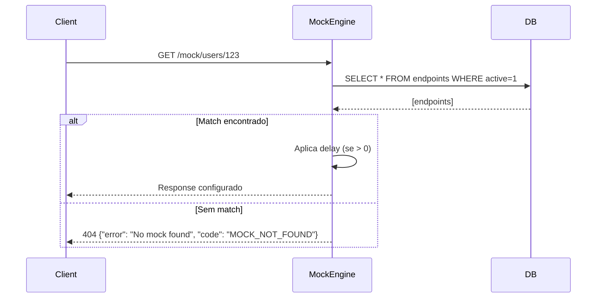

# Design — Cadastro e gerenciamento de endpoints

**Spec:** 001-endpoint-crud
**Status:** aprovado
**Autor:** @architect
**Data:** 2026-04-02

---

## Resumo da solução

Esta feature implementa o CRUD completo de endpoints mock através de uma Admin API REST e uma interface web React. O servidor mock intercepta requests em um prefixo separado (`/mock/*`) e responde conforme os endpoints cadastrados.

### Arquitetura escolhida

```
┌─────────────────┐     ┌─────────────────────────────────────┐
│   React SPA     │────▶│           Fastify Server            │
│   (port 5173)   │     │           (port 3000)               │
└─────────────────┘     │  ┌─────────────┬─────────────────┐  │
                        │  │ Admin API   │   Mock Engine   │  │
                        │  │ /api/*      │   /mock/*       │  │
                        │  └──────┬──────┴────────┬────────┘  │
                        │         │               │           │
                        │         ▼               ▼           │
                        │     ┌───────────────────────┐       │
                        │     │   SQLite (Drizzle)    │       │
                        │     └───────────────────────┘       │
                        └─────────────────────────────────────┘
```

- **Admin API** (`/api/*`): CRUD de endpoints, usado pelo frontend
- **Mock Engine** (`/mock/*`): intercepta requests e retorna responses configurados
- **Separação de prefixos**: evita conflito entre rotas admin e rotas mockadas

### Alternativas descartadas

| Alternativa | Motivo do descarte |
|-------------|-------------------|
| Mock em servidor separado | Complexidade desnecessária para MVP; um único processo simplifica deploy e debug |
| Matching em memória (sem DB) | Perda de dados ao reiniciar; SQLite é leve e persistente |
| GraphQL para Admin API | Overhead de setup; REST é suficiente e mais familiar |
| Prefixo dinâmico para mocks | Complicaria a configuração; `/mock` fixo é previsível |

---

## Schema do banco de dados

### Tabela `endpoints`

```typescript
// apps/api/src/db/schema.ts
import { sqliteTable, text, integer } from 'drizzle-orm/sqlite-core'

export const endpoints = sqliteTable('endpoints', {
  id: text('id').primaryKey(),                    // UUID v4
  name: text('name').notNull(),                   // 1-100 chars
  method: text('method').notNull(),               // GET|POST|PUT|PATCH|DELETE
  path: text('path').notNull(),                   // ex: /users/:id
  active: integer('active', { mode: 'boolean' }).notNull().default(true),
  responseStatus: integer('response_status').notNull(),  // 100-599
  responseBody: text('response_body').notNull().default('{}'),
  responseHeaders: text('response_headers', { mode: 'json' }).notNull().default('{}'),
  delay: integer('delay').notNull().default(0),   // 0-30000 ms
  createdAt: text('created_at').notNull(),        // ISO 8601
  updatedAt: text('updated_at').notNull(),        // ISO 8601
})
```

### Índices

```sql
CREATE UNIQUE INDEX idx_endpoints_method_path_active
ON endpoints(method, path) WHERE active = 1;
```

// Por que: garante unicidade de `method + path` apenas entre endpoints ativos, permitindo múltiplos inativos com mesma combinação.

---

## Contratos de API

### Base URL

- Admin API: `http://localhost:3000/api`
- Mock Engine: `http://localhost:3000/mock`

### Tipos compartilhados

```typescript
type HttpMethod = 'GET' | 'POST' | 'PUT' | 'PATCH' | 'DELETE'

interface Endpoint {
  id: string
  name: string
  method: HttpMethod
  path: string
  active: boolean
  responseStatus: number
  responseBody: string
  responseHeaders: Record<string, string>
  delay: number
  createdAt: string
  updatedAt: string
}

interface ApiError {
  error: string
  code: string
  details?: unknown
}
```

---

### POST /api/endpoints

Cria um novo endpoint mock.

**Request Body:**
```json
{
  "name": "Listar usuários",
  "method": "GET",
  "path": "/users",
  "responseStatus": 200,
  "responseBody": "{\"users\": []}",
  "responseHeaders": { "X-Custom": "value" },
  "delay": 100
}
```

| Campo | Tipo | Obrigatório | Validação |
|-------|------|-------------|-----------|
| name | string | sim | 1-100 caracteres |
| method | enum | sim | GET, POST, PUT, PATCH, DELETE |
| path | string | sim | começa com `/` |
| responseStatus | number | sim | 100-599 |
| responseBody | string | não | default `"{}"` |
| responseHeaders | object | não | default `{}` |
| delay | number | não | 0-30000, default 0 |

**Response 201:**
```json
{
  "id": "550e8400-e29b-41d4-a716-446655440000",
  "name": "Listar usuários",
  "method": "GET",
  "path": "/users",
  "active": true,
  "responseStatus": 200,
  "responseBody": "{\"users\": []}",
  "responseHeaders": { "X-Custom": "value" },
  "delay": 100,
  "createdAt": "2026-04-02T10:00:00.000Z",
  "updatedAt": "2026-04-02T10:00:00.000Z"
}
```

**Erros:**
| Status | Code | Quando |
|--------|------|--------|
| 400 | VALIDATION_ERROR | campos inválidos |
| 409 | CONFLICT | method + path já existe em endpoint ativo |

---

### GET /api/endpoints

Lista todos os endpoints com filtros opcionais.

**Query params:**
| Param | Tipo | Descrição |
|-------|------|-----------|
| search | string | busca em name ou path |
| method | string | filtra por método HTTP |
| active | boolean | filtra por status |

**Response 200:**
```json
{
  "data": [...],
  "total": 1
}
```

---

### GET /api/endpoints/:id

Retorna um endpoint por ID.

**Response 200:** objeto Endpoint

**Erros:**
| Status | Code | Quando |
|--------|------|--------|
| 404 | NOT_FOUND | endpoint não existe |

---

### PUT /api/endpoints/:id

Atualiza um endpoint existente. Todos os campos do body são opcionais.

**Response 200:** objeto Endpoint atualizado

**Erros:**
| Status | Code | Quando |
|--------|------|--------|
| 400 | VALIDATION_ERROR | campos inválidos |
| 404 | NOT_FOUND | endpoint não existe |
| 409 | CONFLICT | novo method + path conflita com outro endpoint ativo |

---

### PATCH /api/endpoints/:id/toggle

Alterna o status ativo/inativo.

**Response 200:**
```json
{
  "id": "...",
  "active": false,
  "updatedAt": "2026-04-02T10:05:00.000Z"
}
```

**Erros:**
| Status | Code | Quando |
|--------|------|--------|
| 404 | NOT_FOUND | endpoint não existe |
| 409 | CONFLICT | ao ativar, method + path já existe em outro ativo |

---

### DELETE /api/endpoints/:id

Remove um endpoint permanentemente.

**Response 204:** sem corpo

**Erros:**
| Status | Code | Quando |
|--------|------|--------|
| 404 | NOT_FOUND | endpoint não existe |

---

## Mock Engine

### Fluxo de matching



### Algoritmo de matching

1. Remove prefixo `/mock` da URL recebida
2. Busca endpoints ativos no banco
3. Para cada endpoint, converte `path` em regex (`:param` → `[^/]+`)
4. Primeiro match vence (ordenado por especificidade: paths sem params primeiro)
5. Se delay > 0, aguarda antes de responder

### Exemplo de matching

| Endpoint path | Request path | Match? |
|---------------|--------------|--------|
| `/users` | `/users` | Sim |
| `/users/:id` | `/users/123` | Sim |
| `/users/:id` | `/users/123/posts` | Não |
| `/orgs/:org/repos/:repo` | `/orgs/acme/repos/api` | Sim |

---

## Páginas do Frontend

### `/` — Lista de endpoints

- Tabela com colunas: Nome, Método (badge), Path, Status code, Ativo (toggle)
- Busca por texto (nome ou path)
- Filtro por método HTTP (dropdown)
- Botão "Novo endpoint" → navega para `/endpoints/new`
- Ações por linha: Editar, Deletar

### `/endpoints/new` — Criar endpoint

- Formulário com campos validados (Zod + react-hook-form)
- Botão salvar → POST /api/endpoints → redireciona para `/`
- Feedback de erro inline

### `/endpoints/:id/edit` — Editar endpoint

- Mesmo formulário do new, preenchido com dados existentes
- Botão salvar → PUT /api/endpoints/:id
- Botão deletar com confirmação

---

## Riscos e decisões

### R1 — Conflito de path ao ativar endpoint

**Risco:** Usuário tem endpoint inativo com path `/users` e tenta ativar, mas já existe outro ativo.
**Decisão:** PATCH toggle retorna 409 com mensagem clara. Frontend exibe o erro.

### R2 — Performance do matching

**Risco:** Muitos endpoints podem tornar matching lento.
**Decisão:** Para o MVP, busca todos os endpoints ativos e faz matching em memória. Adicionar cache futuramente se necessário.

### R3 — Validação de JSON no responseBody

**Decisão:** Não validar como JSON — aceitar qualquer string. O campo `responseBody` permite retornar XML, texto puro, etc.

### R4 — Timestamps ISO vs Unix

**Decisão:** Usar ISO 8601 strings para melhor legibilidade no debug. SQLite armazena como TEXT.

---

## Dependências a instalar

### Backend
`fastify`, `@fastify/cors`, `drizzle-orm`, `drizzle-kit`, `better-sqlite3`, `zod`, `uuid`

### Frontend
`react-router-dom`, `@tanstack/react-query`, `react-hook-form`, `@hookform/resolvers`, `zod`, `zustand`

### DevDependencies
`vitest`, `supertest`, `@testing-library/react`
