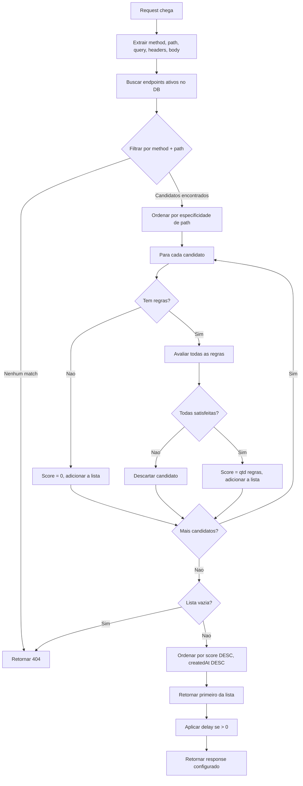

# Design — Matching avancado de requests

**Spec:** 002-advanced-matching
**Status:** aguardando aprovacao
**Autor:** @architect
**Data:** 2026-04-03

---

## Resumo da solucao

Esta feature estende o sistema de matching da Spec 001 para suportar **regras condicionais** baseadas em query params, headers e body JSON. Quando multiplos endpoints compartilham o mesmo `method + path`, o sistema seleciona o mais especifico baseado em quantas regras cada candidato satisfaz.

### Arquitetura escolhida

```
┌─────────────────────────────────────────────────────────────────┐
│                        Mock Engine                              │
│  ┌───────────────┐    ┌───────────────┐    ┌───────────────┐   │
│  │ Path Matcher  │───▶│ Rule Evaluator│───▶│ Score Ranker  │   │
│  │ (existente)   │    │ (novo)        │    │ (novo)        │   │
│  └───────────────┘    └───────────────┘    └───────────────┘   │
└─────────────────────────────────────────────────────────────────┘
```

- **Path Matcher**: filtra candidatos por `method + path` (comportamento atual preservado)
- **Rule Evaluator**: avalia regras de cada candidato contra a request
- **Score Ranker**: seleciona o candidato com maior score (mais regras satisfeitas)

### Alternativas descartadas

| Alternativa | Motivo do descarte |
|-------------|-------------------|
| Regras como JSON no campo `endpoints.matchingRules` | Consultas complexas, sem validacao de integridade referencial, dificil indexacao futura |
| CRUD separado para regras (`/api/matching-rules`) | Overhead de UX — usuario precisaria navegar entre telas; regras fazem sentido apenas no contexto de um endpoint |
| Avaliacao de regras com OR (grupos) | Complexidade prematura; AND cobre 90% dos casos reais. OR pode ser adicionado em spec futura |
| Regex para matching de valores | Risco de ReDoS, complexidade de debug para usuarios nao-tecnicos. `contains` cobre a maioria dos casos |

---

## Mudancas no schema do banco

### Nova tabela `matching_rules`

```typescript
// apps/api/src/db/schema.ts
export const matchingRules = sqliteTable('matching_rules', {
  id: text('id').primaryKey(),                          // UUID v4
  endpointId: text('endpoint_id')
    .notNull()
    .references(() => endpoints.id, { onDelete: 'cascade' }),
  source: text('source').notNull(),                     // 'query' | 'header' | 'body'
  field: text('field').notNull(),                       // ex: 'status', 'x-tenant-id', 'pagamento.tipo'
  operator: text('operator').notNull(),                 // 'eq' | 'neq' | 'contains' | 'exists' | 'not_exists'
  value: text('value'),                                 // null quando operator e 'exists' ou 'not_exists'
  createdAt: text('created_at').notNull(),
}, (table) => [
  index('idx_matching_rules_endpoint_id').on(table.endpointId),
])
```

### Impacto no schema existente

**Nenhuma alteracao na tabela `endpoints`**. A relacao e estabelecida via foreign key em `matching_rules`. Isso permite:
- Adicao incremental sem downtime
- Endpoints existentes continuam funcionando como fallback (score 0)
- Rollback simples: basta ignorar a tabela `matching_rules`

### Indices

| Indice | Colunas | Justificativa |
|--------|---------|---------------|
| `idx_matching_rules_endpoint_id` | `endpoint_id` | Carregamento eficiente das regras ao buscar endpoint |

### Migration

A migration sera **aditiva** — apenas cria a nova tabela. Endpoints existentes sem regras continuam funcionando identicamente.

---

## Contratos de API atualizados

### Tipos compartilhados (novos)

```typescript
type RuleSource = 'query' | 'header' | 'body'
type RuleOperator = 'eq' | 'neq' | 'contains' | 'exists' | 'not_exists'

interface MatchingRule {
  id: string
  endpointId: string
  source: RuleSource
  field: string
  operator: RuleOperator
  value: string | null
  createdAt: string
}

interface MatchingRuleInput {
  source: RuleSource
  field: string
  operator: RuleOperator
  value?: string | null  // obrigatorio para eq/neq/contains, ignorado para exists/not_exists
}
```

### Tipos atualizados

```typescript
// Endpoint agora inclui matchingRules
interface Endpoint {
  // ... campos existentes ...
  matchingRules: MatchingRule[]  // NOVO — sempre presente, pode ser []
}

interface CreateEndpointInput {
  // ... campos existentes ...
  matchingRules?: MatchingRuleInput[]  // NOVO — opcional
}

interface UpdateEndpointInput {
  // ... campos existentes ...
  matchingRules?: MatchingRuleInput[]  // NOVO — substitui regras existentes
}
```

---

### POST /api/endpoints

Cria endpoint com regras opcionais.

**Request Body (atualizado):**
```json
{
  "name": "Pagamento PIX aprovado",
  "method": "POST",
  "path": "/api/pagamentos",
  "responseStatus": 200,
  "responseBody": "{\"status\": \"aprovado\"}",
  "matchingRules": [
    { "source": "body", "field": "tipo", "operator": "eq", "value": "PIX" },
    { "source": "body", "field": "valor", "operator": "exists" }
  ]
}
```

**Validacao adicional:**
| Campo | Validacao |
|-------|-----------|
| `matchingRules[].source` | enum: `query`, `header`, `body` |
| `matchingRules[].field` | string, 1-200 chars, nao pode estar vazio |
| `matchingRules[].operator` | enum: `eq`, `neq`, `contains`, `exists`, `not_exists` |
| `matchingRules[].value` | obrigatorio se operator in [`eq`, `neq`, `contains`]; null/omitido se operator in [`exists`, `not_exists`] |

**Novos erros:**
| Status | Code | Quando |
|--------|------|--------|
| 400 | VALIDATION_ERROR | regra com operator `eq` mas sem `value` |
| 400 | VALIDATION_ERROR | regra com operator `exists` mas com `value` nao-null |

**Response 201:** objeto Endpoint com `matchingRules[]` populado

---

### PUT /api/endpoints/:id

Atualiza endpoint. Se `matchingRules` for fornecido, **substitui completamente** as regras existentes.

**Comportamento:**
- `matchingRules` omitido: nao altera regras existentes
- `matchingRules: []`: remove todas as regras (endpoint vira fallback)
- `matchingRules: [...]`: substitui por novas regras

**Response 200:** objeto Endpoint atualizado com `matchingRules[]`

---

### GET /api/endpoints/:id

**Response 200 (atualizado):**
```json
{
  "id": "...",
  "name": "Pagamento PIX aprovado",
  "method": "POST",
  "path": "/api/pagamentos",
  "active": true,
  "responseStatus": 200,
  "responseBody": "{\"status\": \"aprovado\"}",
  "responseHeaders": {},
  "delay": 0,
  "createdAt": "2026-04-03T10:00:00.000Z",
  "updatedAt": "2026-04-03T10:00:00.000Z",
  "matchingRules": [
    {
      "id": "rule-uuid-1",
      "endpointId": "endpoint-uuid",
      "source": "body",
      "field": "tipo",
      "operator": "eq",
      "value": "PIX",
      "createdAt": "2026-04-03T10:00:00.000Z"
    }
  ]
}
```

---

### GET /api/endpoints

**Response 200 (atualizado):**
```json
{
  "data": [
    {
      "id": "...",
      "name": "...",
      "matchingRules": [...]
    }
  ],
  "total": 1
}
```

---

### Decisao: CRUD separado para regras?

**Decisao: NAO criar CRUD separado.**

Justificativa:
1. Regras so fazem sentido no contexto de um endpoint
2. Gerenciar via `/api/endpoints` simplifica a UX: um form, um submit
3. Substitucao completa (em vez de PATCH incremental) e mais previsivel e evita estados inconsistentes
4. Se no futuro precisarmos de operacoes granulares, podemos adicionar endpoints auxiliares sem quebrar compatibilidade

---

## Algoritmo de resolucao detalhado

### Pseudocodigo

```
funcao resolveEndpoint(method, path, queryParams, headers, body, endpoints):
  // Fase 1: Filtrar por method + path (comportamento existente)
  candidatos = endpoints.filter(e => 
    e.active && 
    e.method == method.toUpperCase() && 
    pathMatches(e.path, path)
  )
  
  if candidatos.isEmpty():
    return null
  
  // Fase 2: Ordenar por especificidade de path (menos params dinamicos primeiro)
  candidatos.sortBy(e => countDynamicSegments(e.path))
  
  // Fase 3: Filtrar por regras e calcular score
  candidatosComScore = []
  
  for each candidato in candidatos:
    regras = candidato.matchingRules
    
    if regras.isEmpty():
      // Endpoint sem regras: sempre candidato com score 0
      candidatosComScore.push({ endpoint: candidato, score: 0 })
      continue
    
    todasSatisfeitas = true
    for each regra in regras:
      if not avaliarRegra(regra, queryParams, headers, body):
        todasSatisfeitas = false
        break
    
    if todasSatisfeitas:
      candidatosComScore.push({ endpoint: candidato, score: regras.length })
  
  if candidatosComScore.isEmpty():
    return null
  
  // Fase 4: Selecionar vencedor
  // Maior score ganha. Empate: createdAt mais recente.
  candidatosComScore.sortBy(c => (-c.score, -parseDate(c.endpoint.createdAt)))
  
  return candidatosComScore[0].endpoint
```

### Funcao avaliarRegra

```
funcao avaliarRegra(regra, queryParams, headers, body):
  valor = extrairValor(regra.source, regra.field, queryParams, headers, body)
  
  switch regra.operator:
    case 'exists':
      return valor !== CAMPO_NAO_EXISTE
    
    case 'not_exists':
      return valor === CAMPO_NAO_EXISTE
    
    case 'eq':
      return valor !== CAMPO_NAO_EXISTE && valor == regra.value
    
    case 'neq':
      return valor === CAMPO_NAO_EXISTE || valor != regra.value
    
    case 'contains':
      return valor !== CAMPO_NAO_EXISTE && 
             typeof valor == 'string' && 
             valor.includes(regra.value)


funcao extrairValor(source, field, queryParams, headers, body):
  switch source:
    case 'query':
      return queryParams[field] ?? CAMPO_NAO_EXISTE
    
    case 'header':
      // Headers sao case-insensitive
      fieldLower = field.toLowerCase()
      for (key, value) in headers:
        if key.toLowerCase() == fieldLower:
          return value
      return CAMPO_NAO_EXISTE
    
    case 'body':
      // Body deve ser JSON valido
      if body nao e objeto JSON:
        return CAMPO_NAO_EXISTE
      return getNestedValue(body, field) ?? CAMPO_NAO_EXISTE


funcao getNestedValue(obj, path):
  // path: "pagamento.cartao.numero" ou "itens.0.sku"
  partes = path.split('.')
  atual = obj
  
  for each parte in partes:
    if atual e null ou undefined:
      return null
    if parte e numero e atual e array:
      atual = atual[parseInt(parte)]
    else:
      atual = atual[parte]
  
  return atual
```

---

### Diagrama de fluxo



---

## Avaliacao de regras por operador e source

### Operador `eq` (igual)

| Source | Comportamento |
|--------|--------------|
| `query` | Compara `queryParams[field]` com `value`. Case-sensitive. |
| `header` | Compara header (busca case-insensitive pelo nome) com `value`. Valor e case-sensitive. |
| `body` | Extrai campo via dot notation, converte para string se necessario, compara com `value`. |

**Exemplos:**
- `query.status eq "ativo"` + request `?status=ativo` → true
- `header.x-tenant-id eq "abc"` + header `X-Tenant-Id: abc` → true
- `body.tipo eq "PIX"` + body `{"tipo": "PIX"}` → true
- `body.valor eq "100"` + body `{"valor": 100}` → true (numero convertido para string)

### Operador `neq` (diferente)

| Source | Comportamento |
|--------|--------------|
| Todos | Retorna true se campo nao existe OU valor e diferente |

**Por que campo inexistente retorna true?**
Semanticamente, "campo diferente de X" inclui "campo nao existe". Isso permite regras como "responda se NAO for ambiente de producao" (`query.env neq "prod"`) que funciona mesmo quando o param esta ausente.

### Operador `contains` (contem substring)

| Source | Comportamento |
|--------|--------------|
| Todos | Retorna true se valor e string e contem a substring |

**Exemplos:**
- `header.user-agent contains "Mozilla"` → true para browsers
- `body.descricao contains "urgente"` → true se descricao contem "urgente"

**Limitacao:** Nao funciona com arrays ou objetos — apenas strings.

### Operador `exists` (campo existe)

| Source | Comportamento |
|--------|--------------|
| Todos | Retorna true se o campo existe na origem (valor pode ser null, "", 0) |

**Exemplos:**
- `header.authorization exists` → true se header presente, mesmo que vazio
- `body.metadata exists` → true se chave existe, mesmo que valor seja null

### Operador `not_exists` (campo nao existe)

| Source | Comportamento |
|--------|--------------|
| Todos | Retorna true se o campo NAO existe na origem |

---

## Casos de borda documentados

### Body nao-JSON

**Cenario:** Request com `Content-Type: text/plain` ou body invalido.

**Comportamento:** Todas as regras de `source: body` falham automaticamente. O endpoint so pode ser selecionado se nao tiver regras de body.

**Implementacao:** `extrairValor('body', ...)` retorna `CAMPO_NAO_EXISTE` se body nao for objeto.

---

### Header case-insensitive

**Cenario:** Regra define `header.X-Tenant-ID`, request envia `x-tenant-id`.

**Comportamento:** Match bem-sucedido. A busca pelo nome do header e case-insensitive (conforme RFC 7230).

**Nota:** O valor comparado ainda e case-sensitive. `X-Tenant-ID: ABC` != `X-Tenant-ID: abc`.

---

### Campo aninhado inexistente

**Cenario:** Regra `body.pagamento.cartao.numero`, body e `{"pagamento": {}}`.

**Comportamento:** `getNestedValue` retorna null ao tentar acessar `cartao` que nao existe. Regra falha (exceto para `not_exists`).

---

### Array indexado no body

**Cenario:** Regra `body.itens.0.sku`, body e `{"itens": [{"sku": "ABC123"}]}`.

**Comportamento:** `getNestedValue` interpreta `0` como indice de array. Retorna `"ABC123"`.

**Limite:** Indices negativos ou fora do range retornam null.

---

### Empate de score

**Cenario:** Dois endpoints com mesmo `method + path` e mesmo numero de regras satisfeitas.

**Comportamento:** O endpoint com `createdAt` mais recente ganha.

**Justificativa:** Permite "sobrescrever" comportamento criando novo endpoint mais especifico, sem precisar deletar o antigo.

---

### Query param com multiplos valores

**Cenario:** Request `?tag=a&tag=b`, regra `query.tag eq "a"`.

**Comportamento:** Fastify retorna array para params repetidos. Comparacao com string falha.

**Decisao:** Nesta spec, nao suportamos arrays em query params. Se `queryParams[field]` for array, a regra falha. Suporte a arrays pode ser adicionado em spec futura com operador `array_contains`.

---

### Valor null explicito no body

**Cenario:** Body `{"campo": null}`, regra `body.campo exists`.

**Comportamento:** Retorna true — o campo existe, mesmo que com valor null.

Para verificar "campo existe E nao e null", usuario precisa criar duas regras: `exists` + `neq "null"`. Isso e intencional para manter operadores simples.

---

## Impacto no EndpointForm do frontend

### Nova secao: Regras de Matching

O formulario de criacao/edicao de endpoint ganhara uma secao colapsavel "Regras de Matching" abaixo dos campos de response.

**Wireframe:**

```
┌─────────────────────────────────────────────────────────────────┐
│ Criar Endpoint                                                  │
├─────────────────────────────────────────────────────────────────┤
│ Nome: [___________________]                                     │
│ Metodo: [GET ▼]  Path: [/api/usuarios____]                     │
│                                                                 │
│ ─── Response ───                                                │
│ Status: [200]  Delay: [0] ms                                   │
│ Body: [__________________________]                              │
│ Headers: [+ Adicionar header]                                   │
│                                                                 │
│ ─── Regras de Matching (opcional) ───────────────── [v]        │
│ │ Origem    │ Campo          │ Operador │ Valor          │ [x] │
│ │ [body ▼]  │ [tipo________] │ [eq ▼]   │ [PIX_________] │ [x] │
│ │ [header▼] │ [x-tenant-id_] │ [exists▼]│ [disabled____] │ [x] │
│ │                                                             │ │
│ │ [+ Adicionar regra]                                         │ │
│ │                                                             │ │
│ │ Preview: POST /api/usuarios                                 │ │
│ │   Header: x-tenant-id: (qualquer valor)                     │ │
│ │   Body: {"tipo": "PIX", ...}                                │ │
│ └─────────────────────────────────────────────────────────────┘ │
│                                                                 │
│ [Cancelar]                                    [Salvar Endpoint] │
└─────────────────────────────────────────────────────────────────┘
```

### Componentes necessarios

| Componente | Responsabilidade |
|------------|------------------|
| `MatchingRulesSection` | Container colapsavel para a lista de regras |
| `MatchingRuleRow` | Linha individual com selects e inputs |
| `MatchingRulePreview` | Gera exemplo de request que satisfaria as regras |

### Integracao com react-hook-form

```typescript
// Dentro do schema do formulario
const endpointFormSchema = z.object({
  // ... campos existentes ...
  matchingRules: z.array(z.object({
    source: z.enum(['query', 'header', 'body']),
    field: z.string().min(1).max(200),
    operator: z.enum(['eq', 'neq', 'contains', 'exists', 'not_exists']),
    value: z.string().nullable(),
  })).default([]),
})
```

### Validacao no frontend

- Campo `value` desabilitado quando operator e `exists` ou `not_exists`
- Campo `value` obrigatorio quando operator e `eq`, `neq` ou `contains`
- Feedback visual se regra esta incompleta

---

## Riscos e decisoes

### R1 — Performance com muitas regras

**Risco:** Endpoints com dezenas de regras podem tornar matching lento.

**Mitigacao:** 
- Limite de 20 regras por endpoint (validado na API)
- Regras sao carregadas em batch junto com endpoints (JOIN ou query separada)
- Se necessario futuramente: cache de endpoints ativos em memoria

**Decisao:** Implementar limite de 20 regras. Monitorar performance em producao.

---

### R2 — Parsing de body JSON

**Risco:** Body grande ou malformado pode causar erro no parsing.

**Mitigacao:**
- Fastify ja faz parsing de JSON por padrao
- Se body nao for JSON valido, `request.body` e string/undefined
- Engine trata graciosamente: regras de body falham, endpoint sem regras de body pode ser selecionado

**Decisao:** Reusar parsing do Fastify. Nao fazer parse manual.

---

### R3 — Migracao sem downtime

**Risco:** Adicionar tabela `matching_rules` enquanto sistema esta em uso.

**Mitigacao:**
- Migration apenas adiciona tabela nova (nao altera `endpoints`)
- Codigo novo e backward-compatible: endpoints sem regras funcionam identicamente
- Deploy pode ser feito em duas fases: 1) migration, 2) deploy do codigo

**Decisao:** Migration aditiva. Sem downtime esperado.

---

### R4 — Consistencia ao deletar endpoint

**Risco:** Deletar endpoint deve deletar suas regras.

**Mitigacao:** Foreign key com `ON DELETE CASCADE`. SQLite suporta se `PRAGMA foreign_keys = ON`.

**Decisao:** Habilitar foreign keys no Drizzle config. Testar cascade em integracao.

---

### R5 — Ordenacao de endpoints atualizada

**Risco:** A query atual busca todos os endpoints ativos. Com matching avancado, precisamos tambem carregar regras.

**Decisao:** Duas estrategias possiveis:
1. **JOIN:** Uma query com LEFT JOIN em `matching_rules`, agrupa no codigo
2. **Queries separadas:** Busca endpoints, depois busca regras dos IDs retornados

Escolha: **Queries separadas** para manter simplicidade. JOIN com agregacao em SQLite e verbose. Performance similar para < 1000 endpoints.

---

## Dependencias novas

Nenhuma dependencia nova necessaria. Stack existente suporta todos os requisitos.

---

## Checklist de compatibilidade

- [x] Endpoints sem regras continuam funcionando (score 0, fallback)
- [x] API existente nao quebra (matchingRules e opcional no create/update)
- [x] Frontend existente continua funcionando (secao de regras e aditiva)
- [x] Testes existentes continuam passando
- [x] Migration e aditiva, sem ALTER TABLE
