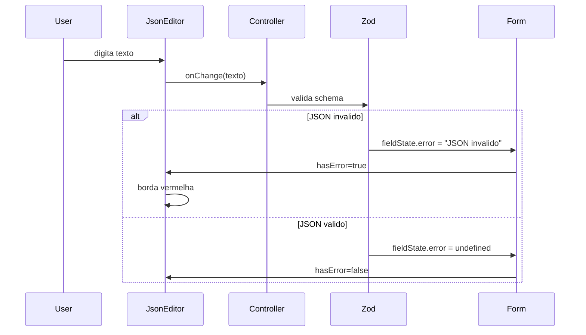

# Design — Spec 003: Editor de Codigo para Campos JSON

**Status:** aprovado  
**Autor:** @architect  
**Data:** 2026-04-03

---

## Resumo da Solucao

Criar um componente `<JsonEditor>` reutilizavel baseado em CodeMirror 6, usando o wrapper React
`@uiw/react-codemirror`. O componente substitui o `<textarea>` atual no campo `responseBody` do
formulario de endpoint e sera usado tambem no campo `value` das regras de matching quando
`source === "body"`.

---

## Decisao de Biblioteca

### Escolhida: CodeMirror 6 via @uiw/react-codemirror

**Pacotes necessarios:**
```
@uiw/react-codemirror
@codemirror/lang-json
```

**Justificativas:**
- Leve (~50kb gzipped com extensoes JSON) vs Monaco (~2MB)
- API React bem documentada e estavel
- Suporte nativo a highlight JSON, bracket matching, folding
- Suporte a temas light/dark via CSS variables
- Ativa e mantida (ultima release < 6 meses)

### Alternativas descartadas

| Alternativa       | Motivo da rejeicao                                          |
|-------------------|-------------------------------------------------------------|
| Monaco Editor     | ~2MB, overkill para editar JSON simples                     |
| Ace Editor        | API mais antiga, menos atualizacoes recentes                |
| PrismJS + textarea| Sem suporte nativo a Tab, autocomplete de brackets          |

---

## Estrutura do Componente

### Interface publica

```typescript
// apps/web/src/components/json-editor.tsx

interface JsonEditorProps {
  value: string
  onChange: (value: string) => void
  onValidationChange?: (isValid: boolean) => void
  placeholder?: string
  minHeight?: number  // px, default 120
  maxHeight?: number  // px, default 480
  readOnly?: boolean  // default false
  hasError?: boolean  // borda vermelha externa (controlada pelo form)
}
```

### Responsabilidades do componente

1. Renderizar CodeMirror com extensoes JSON (highlight, bracket matching)
2. Emitir `onChange` a cada alteracao de texto
3. Emitir `onValidationChange(boolean)` quando validade do JSON muda
4. Aplicar altura dinamica (min/max) via CSS
5. Suportar tema claro (usando CSS variables do projeto)

### Responsabilidades do form (nao do componente)

- Validar JSON via Zod schema
- Mostrar mensagem de erro abaixo do editor
- Desabilitar botao de submit quando invalido

---

## Integracao com react-hook-form

### Abordagem: Controller

Usar `Controller` do react-hook-form em vez de `register()` porque CodeMirror nao e um input
nativo e precisa de controle explicito de `value` e `onChange`.

```tsx
// Dentro de endpoint-form.tsx
<Controller
  name="responseBody"
  control={control}
  render={({ field, fieldState }) => (
    <JsonEditor
      value={field.value}
      onChange={field.onChange}
      hasError={!!fieldState.error}
    />
  )}
/>
```

### Validacao Zod

Adicionar refinamento ao schema para validar JSON:

```typescript
// helper em apps/web/src/lib/json-utils.ts
export function isValidJson(str: string): boolean {
  if (!str.trim()) return false
  try {
    JSON.parse(str)
    return true
  } catch {
    return false
  }
}

// No formSchema de endpoint-form.tsx
responseBody: z.string()
  .min(1, 'Body e obrigatorio')
  .refine(isValidJson, { message: 'JSON invalido' })
```

---

## Impacto em Arquivos Existentes

### 1. apps/web/src/components/endpoint-form.tsx

**Mudancas:**
- Importar `Controller` de react-hook-form
- Importar `JsonEditor` de `@web/components/json-editor`
- Substituir `<textarea>` (linhas 271-278) por `<Controller>` + `<JsonEditor>`
- Atualizar schema: `responseBody` de opcional para obrigatorio com refinamento JSON
- Valor default: `'{}'` em vez de `''`

**Antes (linha 271-278):**
```tsx
<textarea
  id="responseBody"
  rows={6}
  placeholder='{"status": "ok"}'
  className="..."
  {...register('responseBody')}
/>
```

**Depois:**
```tsx
<Controller
  name="responseBody"
  control={control}
  render={({ field, fieldState }) => (
    <JsonEditor
      value={field.value}
      onChange={field.onChange}
      hasError={!!fieldState.error}
      placeholder="{}"
    />
  )}
/>
```

### 2. apps/web/src/components/matching-rule-row.tsx

**Mudancas:**
- Importar `JsonEditor`
- Renderizar `JsonEditor` no campo `value` quando `source === "body"`
- Manter `Input` para outros sources (query, header)

**Logica condicional:**
```tsx
{value.source === 'body' ? (
  <JsonEditor
    value={value.value ?? ''}
    onChange={(v) => onChange({ ...value, value: v })}
    minHeight={80}
    maxHeight={200}
  />
) : (
  <Input ... />
)}
```

### 3. Novo arquivo: apps/web/src/components/json-editor.tsx

Componente novo (~80 linhas).

### 4. Novo arquivo: apps/web/src/lib/json-utils.ts

Helper `isValidJson()` (~10 linhas).

### 5. apps/web/src/index.css

Adicionar estilos para CodeMirror integrar com tema do projeto.

### 6. apps/web/package.json

Adicionar dependencias:
```json
"@uiw/react-codemirror": "^4.21.0",
"@codemirror/lang-json": "^6.0.0"
```

---

## Tematizacao

O projeto usa CSS variables para cores (ver tailwind.config.js). CodeMirror suporta temas
customizados via `EditorView.theme()`.

Criar tema minimalista que use as variaveis existentes:

```typescript
const stubLabTheme = EditorView.theme({
  '&': {
    backgroundColor: 'hsl(var(--background))',
    color: 'hsl(var(--foreground))',
  },
  '.cm-content': {
    fontFamily: 'ui-monospace, monospace',
    fontSize: '14px',
  },
  '.cm-gutters': {
    backgroundColor: 'hsl(var(--muted))',
    borderRight: '1px solid hsl(var(--border))',
  },
  '&.cm-focused': {
    outline: 'none',
  },
})
```

Adicionar classe wrapper para borda de erro:

```css
/* index.css */
.json-editor-wrapper {
  border-radius: var(--radius);
  border: 1px solid hsl(var(--input));
  overflow: hidden;
}

.json-editor-wrapper:focus-within {
  ring: 1px hsl(var(--ring));
}

.json-editor-wrapper[data-error="true"] {
  border-color: hsl(var(--destructive));
}
```

---

## Funcionalidade: Formatar JSON

Botao "Formatar" acima do editor ou atalho Shift+Alt+F.

**Implementacao:**
```typescript
function handleFormat() {
  try {
    const parsed = JSON.parse(value)
    const formatted = JSON.stringify(parsed, null, 2)
    onChange(formatted)
  } catch {
    // Ignora se invalido (erro ja visivel)
  }
}
```

O botao fica dentro do componente JsonEditor, no canto superior direito, com icone de "code"
(lucide-react).

---

## Altura Dinamica

CodeMirror nao cresce automaticamente por padrao. Usar extensao `EditorView.lineWrapping` +
CSS para controlar altura:

```css
.json-editor-content {
  min-height: 120px;
  max-height: 480px;
  overflow-y: auto;
}
```

Props `minHeight` e `maxHeight` sao aplicadas via style inline para permitir customizacao.

---

## Fluxo de Validacao



---

## Decisoes Arquiteturais

### Por que Controller em vez de register?

O `register()` do react-hook-form funciona com refs de inputs nativos. CodeMirror e um componente
controlado que precisa receber `value` e chamar `onChange` explicitamente. Controller e a
abordagem padrao para componentes customizados.

### Por que validacao no form e nao no componente?

Manter o componente JsonEditor puro (apenas renderizacao e edicao) segue o principio de
responsabilidade unica. O form ja tem toda a logica de validacao via Zod. Duplicar validacao
no componente criaria dois pontos de verdade.

O callback `onValidationChange` e opcional e serve apenas para otimizacoes de UX (ex: feedback
imediato) sem substituir a validacao do form.

### Por que nao usar dark mode agora?

O projeto ainda nao tem suporte a dark mode (ver index.css — apenas variaveis light). Quando
dark mode for implementado (spec futura), basta adicionar media query para as variaveis CSS
e CodeMirror herdara automaticamente.

---

## Riscos e Mitigacoes

| Risco | Probabilidade | Impacto | Mitigacao |
|-------|---------------|---------|-----------|
| Bundle size aumenta | Media | Baixo | CodeMirror e ~50kb gzip, aceitavel |
| Performance em JSON grande | Baixa | Medio | maxHeight com scroll, lazy parsing |
| Conflito de atalhos | Baixa | Baixo | Tab/Shift+Tab sao padrao CodeMirror |
| SSR incompativel | N/A | N/A | Projeto e SPA (Vite), sem SSR |

---

## Fora do Escopo (decisoes adiadas)

- Autocomplete de campos baseado em schema JSON
- Diff side-by-side
- Suporte a XML/YAML
- Snippets reutilizaveis
- Uso em responseHeaders (manter key-value simples por ora)

---

## Checklist de Validacao do Design

- [x] Biblioteca escolhida e justificada
- [x] Interface do componente definida
- [x] Integracao com react-hook-form documentada
- [x] Impacto em arquivos existentes mapeado
- [x] Tematizacao compativel com projeto
- [x] Riscos identificados
