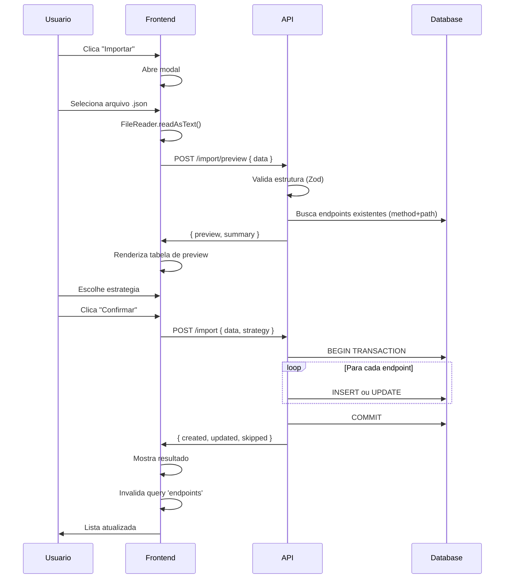

# Design — Spec 004: Import e Export de Endpoints

**Status:** aguardando aprovacao  
**Autor:** @architect  
**Criado em:** 2026-04-03  
**Baseado em:** requirements.md v1

---

## Resumo da solucao

Implementar tres endpoints na API para suportar export e import de endpoints:

1. **GET /api/endpoints/export** — retorna JSON com todos os endpoints ou subconjunto (por IDs)
2. **POST /api/endpoints/import/preview** — valida arquivo e retorna preview sem persistir
3. **POST /api/endpoints/import** — executa importacao com estrategia de conflito

No frontend, adicionar checkboxes na tabela de endpoints, botoes de export (todos/selecionados), e um modal de import com fluxo: upload -> preview -> confirmar.

### Alternativas descartadas

| Alternativa | Motivo do descarte |
|-------------|-------------------|
| Usar multipart/form-data para upload | Complexidade desnecessaria — JSON no body e leitura via FileReader no frontend e suficiente |
| Endpoint unico POST /import com flag `dryRun` | Separar preview de execucao em rotas distintas e mais explicito e evita bugs de logica condicional |
| Streaming de arquivo grande | Overkill — limite de 1000 endpoints por arquivo e razoavel para MVP |

---

## API Endpoints

### 1. GET /api/endpoints/export

Exporta endpoints em formato JSON.

**Query params:**
| Param | Tipo | Obrigatorio | Descricao |
|-------|------|-------------|-----------|
| ids | string | nao | IDs separados por virgula. Se omitido, exporta todos. |

**Response 200:**
```json
{
  "version": "1",
  "exportedAt": "2026-04-03T14:30:00Z",
  "exportedBy": "StubLab",
  "count": 2,
  "endpoints": [
    {
      "name": "Listar usuarios",
      "method": "GET",
      "path": "/api/usuarios",
      "active": true,
      "responseStatus": 200,
      "responseBody": "{}",
      "responseHeaders": {},
      "delay": 0,
      "matchingRules": []
    }
  ]
}
```

**Erros:**
| Status | code | Quando |
|--------|------|--------|
| 400 | VALIDATION_ERROR | `ids` contem valor invalido (nao-UUID) |
| 404 | NOT_FOUND | Um ou mais IDs nao existem |

**Por que retornar 404 se algum ID nao existe:**  
Exportar um subconjunto incompleto sem aviso pode causar confusao. Melhor falhar explicito.

---

### 2. POST /api/endpoints/import/preview

Valida o arquivo e retorna preview do que sera criado/atualizado.

**Request body:**
```json
{
  "data": {
    "version": "1",
    "exportedAt": "2026-04-03T14:30:00Z",
    "exportedBy": "StubLab",
    "count": 2,
    "endpoints": [...]
  }
}
```

**Response 200:**
```json
{
  "valid": true,
  "version": "1",
  "totalInFile": 2,
  "preview": [
    {
      "index": 0,
      "name": "Listar usuarios",
      "method": "GET",
      "path": "/api/usuarios",
      "status": "new",
      "rulesCount": 0,
      "errors": []
    },
    {
      "index": 1,
      "name": "Criar usuario",
      "method": "POST",
      "path": "/api/usuarios",
      "status": "conflict",
      "existingId": "uuid-do-existente",
      "rulesCount": 2,
      "errors": []
    }
  ],
  "summary": {
    "new": 1,
    "conflict": 1,
    "invalid": 0
  }
}
```

**Campos de status em cada item:**
- `new` — nao existe endpoint com mesmo method+path
- `conflict` — ja existe endpoint com mesmo method+path
- `invalid` — endpoint tem erros de validacao

**Response com erros de validacao (ainda 200, pois o preview foi gerado):**
```json
{
  "valid": false,
  "version": "1",
  "totalInFile": 2,
  "preview": [
    {
      "index": 0,
      "name": "Endpoint quebrado",
      "method": "INVALID",
      "path": "/api/test",
      "status": "invalid",
      "rulesCount": 0,
      "errors": ["method deve ser GET, POST, PUT, PATCH ou DELETE"]
    }
  ],
  "summary": {
    "new": 0,
    "conflict": 0,
    "invalid": 1
  }
}
```

**Erros:**
| Status | code | Quando |
|--------|------|--------|
| 400 | INVALID_JSON | Body nao e JSON valido |
| 400 | INVALID_FORMAT | JSON nao segue estrutura esperada (sem `endpoints`, etc) |

---

### 3. POST /api/endpoints/import

Executa a importacao com a estrategia escolhida.

**Request body:**
```json
{
  "data": { ... },
  "strategy": "skip" | "overwrite" | "duplicate"
}
```

**Estrategias:**
| Valor | Comportamento |
|-------|---------------|
| skip | Ignora endpoints que ja existem (method+path). Cria apenas os novos. |
| overwrite | Atualiza endpoints existentes com os dados do arquivo. Cria os novos. |
| duplicate | Cria todos como novos endpoints, mesmo que resulte em duplicatas. |

**Response 200:**
```json
{
  "created": 3,
  "updated": 2,
  "skipped": 1,
  "errors": []
}
```

**Response com erros parciais (rollback aplicado):**
```json
{
  "created": 0,
  "updated": 0,
  "skipped": 0,
  "errors": [
    { "index": 2, "message": "Erro ao criar endpoint: constraint violation" }
  ]
}
```

**Erros:**
| Status | code | Quando |
|--------|------|--------|
| 400 | INVALID_JSON | Body nao e JSON valido |
| 400 | INVALID_FORMAT | JSON nao segue estrutura esperada |
| 400 | VALIDATION_ERROR | `strategy` invalida |
| 500 | IMPORT_FAILED | Erro durante persistencia (rollback aplicado) |

---

## Schemas Zod

### Arquivo: `apps/api/src/schemas/import-export.ts`

```typescript
import { z } from 'zod'
import { matchingRuleSchema } from './matching-rule.js'

// Schema de um endpoint no arquivo de export (sem id, createdAt, updatedAt)
export const exportedEndpointSchema = z.object({
  name: z.string().min(1).max(100),
  method: z.enum(['GET', 'POST', 'PUT', 'PATCH', 'DELETE']),
  path: z.string().min(1).startsWith('/'),
  active: z.boolean().default(true),
  responseStatus: z.number().int().min(100).max(599),
  responseBody: z.string().default('{}'),
  responseHeaders: z.record(z.string()).default({}),
  delay: z.number().int().min(0).max(30000).default(0),
  matchingRules: z.array(
    z.object({
      source: z.enum(['query', 'header', 'body']),
      field: z.string().min(1),
      operator: z.enum(['eq', 'neq', 'contains', 'exists', 'not_exists']),
      value: z.string().nullable().optional(),
    })
  ).default([]),
})

export const exportFileSchema = z.object({
  version: z.string(),
  exportedAt: z.string(),
  exportedBy: z.string(),
  count: z.number().int().min(0),
  endpoints: z.array(exportedEndpointSchema).max(1000),
})

export const importPreviewBodySchema = z.object({
  data: exportFileSchema,
})

export const importBodySchema = z.object({
  data: exportFileSchema,
  strategy: z.enum(['skip', 'overwrite', 'duplicate']),
})

export type ExportedEndpoint = z.infer<typeof exportedEndpointSchema>
export type ExportFile = z.infer<typeof exportFileSchema>
export type ImportStrategy = z.infer<typeof importBodySchema>['strategy']
```

---

## Logica de Export (Backend)

### Arquivo: `apps/api/src/services/import-export-service.ts`

```typescript
export const ImportExportService = {
  async exportEndpoints(ids?: string[]): Promise<ExportFile> {
    // 1. Buscar endpoints (todos ou por IDs)
    // 2. Carregar matchingRules para cada endpoint
    // 3. Serializar omitindo id, createdAt, updatedAt
    // 4. Retornar estrutura do arquivo
  },

  async previewImport(data: ExportFile): Promise<ImportPreviewResult> {
    // 1. Para cada endpoint no arquivo:
    //    a. Validar com Zod (capturar erros)
    //    b. Verificar se existe endpoint com mesmo method+path
    //    c. Classificar: new | conflict | invalid
    // 2. Retornar preview com summary
  },

  async executeImport(data: ExportFile, strategy: ImportStrategy): Promise<ImportResult> {
    // 1. Iniciar transacao SQLite
    // 2. Para cada endpoint valido:
    //    a. Se strategy=skip e existe conflito: pular
    //    b. Se strategy=overwrite e existe conflito: atualizar
    //    c. Se strategy=duplicate ou nao ha conflito: criar novo
    // 3. Commit ou rollback em caso de erro
    // 4. Retornar contadores
  },
}
```

### Deteccao de conflito

Conflito e detectado por `method + path`:

```typescript
const existing = await db
  .select({ id: endpoints.id })
  .from(endpoints)
  .where(
    and(
      eq(endpoints.method, importedEndpoint.method),
      eq(endpoints.path, importedEndpoint.path),
    )
  )
const hasConflict = existing.length > 0
```

**Por que nao considerar matchingRules na deteccao de conflito:**  
A spec define conflito apenas por method+path. Regras de matching sao uma configuracao do endpoint, nao parte da identidade. Isso mantem a logica simples e previsivel.

### Transacao (SQLite via Drizzle)

O Drizzle com better-sqlite3 suporta transacoes sincrona:

```typescript
import { db } from '../db/index.js'

// Por que: SQLite em better-sqlite3 usa transacoes sincronas.
// O padrao db.transaction(...) do Drizzle encapsula begin/commit/rollback.
const result = db.transaction((tx) => {
  for (const endpoint of validEndpoints) {
    // ... logica de insert/update usando tx ao inves de db
  }
  return { created, updated, skipped }
})
```

---

## Logica de Import — Detalhes das Estrategias

### skip (Ignorar existentes)

```
Para cada endpoint no arquivo:
  Se existe conflito (mesmo method+path):
    skipped++
  Senao:
    Criar endpoint + matchingRules
    created++
```

### overwrite (Sobrescrever existentes)

```
Para cada endpoint no arquivo:
  Se existe conflito:
    Atualizar endpoint existente com dados do arquivo
    Deletar matchingRules antigas
    Criar novas matchingRules
    updated++
  Senao:
    Criar endpoint + matchingRules
    created++
```

**Nota:** O update preserva o `id` e `createdAt` original, mas atualiza `updatedAt`.

### duplicate (Importar como novos)

```
Para cada endpoint no arquivo:
  Criar endpoint com novo ID + matchingRules
  created++
```

**Risco:** Pode criar multiplos fallbacks (endpoints sem regras) no mesmo method+path.  
**Decisao:** Permitir, pois o usuario escolheu explicitamente essa estrategia. O mock engine usara o mais recente (por createdAt DESC).

---

## Frontend — Novos Componentes e Hooks

### Alteracoes na EndpointTable

Adicionar coluna de checkbox para selecao multipla:

```
apps/web/src/components/endpoint-table.tsx
  - Nova prop: selectable?: boolean
  - Nova prop: selectedIds?: string[]
  - Nova prop: onSelectionChange?: (ids: string[]) => void
  - Checkbox no header para "selecionar todos"
  - Checkbox em cada linha
```

### Alteracoes na EndpointsList

```
apps/web/src/pages/endpoints-list.tsx
  - Estado: selectedIds: string[]
  - Botao "Exportar tudo" (sempre visivel)
  - Botao "Exportar selecionados (N)" (visivel quando N > 0)
  - Botao "Importar" (abre modal)
```

### Novo componente: ImportModal

```
apps/web/src/components/import-modal.tsx
  - Dialog do shadcn/ui
  - Estados: idle | uploading | previewing | importing | done | error
  - Fluxo:
    1. Input file (aceita .json)
    2. Ao selecionar: lê arquivo com FileReader, chama POST /import/preview
    3. Mostra tabela de preview com status de cada endpoint
    4. Select para estrategia (default: skip)
    5. Botao "Confirmar importacao"
    6. Ao confirmar: chama POST /import
    7. Mostra resultado (toast ou banner)
```

### Novo componente: ImportPreviewTable

```
apps/web/src/components/import-preview-table.tsx
  - Recebe preview do backend
  - Mostra: method badge, path, status badge (Novo/Conflito/Invalido), erros
```

### Novos hooks

```
apps/web/src/hooks/use-export-endpoints.ts
  - Funcao exportAll(): dispara download
  - Funcao exportSelected(ids: string[]): dispara download

apps/web/src/hooks/use-import-endpoints.ts
  - useMutation para POST /import/preview
  - useMutation para POST /import
```

### Download do arquivo

```typescript
// Por que nao usar um endpoint que retorna Content-Disposition attachment:
// O frontend precisa controlar o nome do arquivo (stublab-export-YYYY-MM-DD.json).
// Fazer o download via Blob e mais flexivel e evita abrir nova aba.

function downloadJson(data: object, filename: string) {
  const blob = new Blob([JSON.stringify(data, null, 2)], { type: 'application/json' })
  const url = URL.createObjectURL(blob)
  const a = document.createElement('a')
  a.href = url
  a.download = filename
  a.click()
  URL.revokeObjectURL(url)
}
```

---

## Estrutura de arquivos novos

### Backend

```
apps/api/src/
  schemas/
    import-export.ts          # Zod schemas para import/export
  services/
    import-export-service.ts  # Logica de export, preview, execute
  routes/endpoints/
    export.ts                 # GET /api/endpoints/export
    import-preview.ts         # POST /api/endpoints/import/preview
    import.ts                 # POST /api/endpoints/import
```

### Frontend

```
apps/web/src/
  components/
    import-modal.tsx          # Modal completo de import
    import-preview-table.tsx  # Tabela de preview
  hooks/
    use-export-endpoints.ts   # Funcoes de download
    use-import-endpoints.ts   # Mutations para preview e import
```

---

## O que NAO muda

| Arquivo/Componente | Motivo |
|-------------------|--------|
| mock/engine.ts | Nao afeta logica de matching |
| mock/handler.ts | Nao afeta handling de requests |
| mock/rule-evaluator.ts | Nao afeta avaliacao de regras |
| endpoint-form.tsx | Import nao usa o form, cria direto |
| matching-rule-row.tsx | Nao afeta edicao de regras |
| db/schema.ts | Nenhuma alteracao de schema |

---

## Riscos e Mitigacoes

| Risco | Impacto | Mitigacao |
|-------|---------|-----------|
| Arquivo muito grande trava o browser | Alto | Limite de 1000 endpoints no schema Zod. Mostrar erro antes de processar. |
| Conflito de fallbacks na estrategia duplicate | Medio | Documentar no modal que pode criar duplicatas. Mock engine resolve por createdAt. |
| Versao futura do formato incompativel | Baixo | Campo `version` permite migracoes. Logar warning para versao > atual. |
| Transacao falha no meio da importacao | Alto | Rollback automatico do SQLite. Retornar erro claro ao usuario. |

---

## Diagrama de fluxo — Import



---

## Proximos passos

1. Revisar este design com o time
2. Aprovar e gerar tasks.md
3. Iniciar implementacao pelo backend (T01-T06)
4. Testes de integracao
5. Frontend (T07-T12)
6. Testes E2E
7. Code review final
