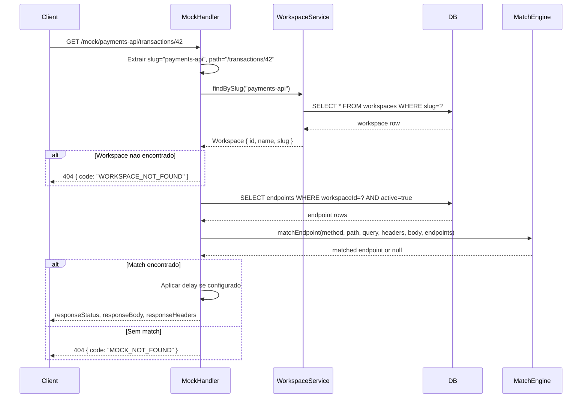

# Design — Spec 006: Multi-tenant Workspaces

**Spec:** 006-workspaces  
**Status:** em revisao  
**Autor:** @architect  
**Data:** 2026-04-04

---

## Resumo da solucao

Workspaces sao entidades de primeiro nivel que agrupam endpoints. Cada workspace tem um `slug` unico que:
1. Serve como namespace na admin API (`/api/workspaces/{slug}/endpoints`)
2. Serve como prefixo no mock server (`/mock/{slug}/...`)

A implementacao segue o padrao existente: tabela Drizzle, service, rotas Fastify, hooks React.

### Alternativas descartadas

| Alternativa | Motivo da rejeicao |
|-------------|-------------------|
| Workspace como header (`X-Workspace-Slug`) no mock server | Dificulta configuracao em aplicacoes cliente; subpath e mais explicito e facil de inspecionar |
| Workspace como subdomain (`payments-api.stublab:4000`) | Requer configuracao de DNS/wildcard, complexifica deploy local |
| Workspace opcional (endpoints podem existir sem workspace) | Cria ambiguidade; migrar endpoints orfaos seria problematico; preferimos workspace obrigatorio com "default" criado na migracao |

---

## Modelo de dados

### Nova tabela: `workspaces`

```typescript
// apps/api/src/db/schema.ts

export const workspaces = sqliteTable('workspaces', {
  id: text('id').primaryKey(),
  name: text('name').notNull(),
  slug: text('slug').notNull().unique(),
  createdAt: text('created_at').notNull(),
  updatedAt: text('updated_at').notNull(),
}, (table) => [
  // Por que: busca por slug e mais frequente que por id (mock handler).
  // A constraint unique ja cria indice, mas deixamos explicito para clareza.
])
```

### Alteracao na tabela `endpoints`

```typescript
export const endpoints = sqliteTable('endpoints', {
  // ... campos existentes ...
  workspaceId: text('workspace_id')
    .notNull()
    .references(() => workspaces.id, { onDelete: 'cascade' }),
}, (table) => [
  // Indice composto para busca no mock handler
  index('idx_endpoints_workspace_method_path').on(
    table.workspaceId,
    table.method,
    table.path,
  ),
])
```

### Constraints de unicidade

A unicidade `method + path` por workspace e enforced na camada de servico (como ja e feito hoje para fallbacks). Nao criamos UNIQUE constraint no banco porque:
- Multiplos endpoints ativos com mesmo `method + path` sao validos quando tem matching rules distintas (spec-002)
- A regra de "apenas um fallback" e logica de negocio, nao constraint de schema

---

## Migracao de dados existentes

### Estrategia

1. Criar tabela `workspaces`
2. Inserir workspace padrao: `id=uuid`, `name="Default"`, `slug="default"`
3. Adicionar coluna `workspace_id` em `endpoints` com valor padrao temporario
4. Atualizar todos os endpoints existentes com o id do workspace "default"
5. Remover valor padrao da coluna (NOT NULL sem default)

### Script de migracao (Drizzle generate)

```sql
-- Passo 1: criar tabela workspaces
CREATE TABLE workspaces (
  id TEXT PRIMARY KEY,
  name TEXT NOT NULL,
  slug TEXT NOT NULL UNIQUE,
  created_at TEXT NOT NULL,
  updated_at TEXT NOT NULL
);

-- Passo 2: inserir workspace padrao
INSERT INTO workspaces (id, name, slug, created_at, updated_at)
VALUES ('00000000-0000-0000-0000-000000000001', 'Default', 'default', datetime('now'), datetime('now'));

-- Passo 3: adicionar coluna workspace_id
ALTER TABLE endpoints ADD COLUMN workspace_id TEXT REFERENCES workspaces(id) ON DELETE CASCADE;

-- Passo 4: migrar endpoints existentes
UPDATE endpoints SET workspace_id = '00000000-0000-0000-0000-000000000001';

-- Passo 5: criar indice
CREATE INDEX idx_endpoints_workspace_method_path ON endpoints(workspace_id, method, path);
```

Por que UUID fixo para workspace default: permite que a migracao seja idempotente e que codigo possa referenciar esse workspace de forma deterministica se necessario.

---

## API — Workspaces CRUD

### Tipos compartilhados

```typescript
// apps/api/src/types/workspace.ts

export interface Workspace {
  id: string
  name: string
  slug: string
  createdAt: string
  updatedAt: string
}

export interface CreateWorkspaceInput {
  name: string
  slug: string
}

export interface UpdateWorkspaceInput {
  name?: string
  slug?: string  // permitido, mas UI mostra aviso
}

export interface WorkspaceWithStats extends Workspace {
  endpointCount: number
  activeEndpointCount: number
}
```

### Rotas

#### `POST /api/workspaces`

Cria novo workspace.

**Request body:**
```json
{
  "name": "Payments API",
  "slug": "payments-api"
}
```

**Validacao Zod:**
```typescript
const createWorkspaceSchema = z.object({
  name: z.string().min(1).max(100),
  slug: z.string()
    .min(3).max(60)
    .regex(/^[a-z0-9]+(-[a-z0-9]+)*$/, 'Slug deve conter apenas letras minusculas, numeros e hifens, sem comecar ou terminar com hifen'),
})
```

**Responses:**
- `201 Created` — workspace criado
- `400 Bad Request` — validacao falhou (`VALIDATION_ERROR`)
- `409 Conflict` — slug ja existe (`SLUG_CONFLICT`)

---

#### `GET /api/workspaces`

Lista todos os workspaces com estatisticas.

**Response:**
```json
{
  "data": [
    {
      "id": "uuid",
      "name": "Payments API",
      "slug": "payments-api",
      "endpointCount": 12,
      "activeEndpointCount": 10,
      "createdAt": "2026-04-04T10:00:00Z",
      "updatedAt": "2026-04-04T10:00:00Z"
    }
  ],
  "total": 1
}
```

---

#### `GET /api/workspaces/:slug`

Busca workspace por slug.

**Responses:**
- `200 OK` — workspace encontrado (com stats)
- `404 Not Found` — `WORKSPACE_NOT_FOUND`

---

#### `PUT /api/workspaces/:slug`

Atualiza workspace.

**Request body:**
```json
{
  "name": "Payments API v2",
  "slug": "payments-api-v2"  // opcional, UI deve avisar sobre quebra de URLs
}
```

**Responses:**
- `200 OK` — workspace atualizado
- `400 Bad Request` — validacao falhou
- `404 Not Found` — workspace nao encontrado
- `409 Conflict` — novo slug ja existe

---

#### `DELETE /api/workspaces/:slug`

Deleta workspace e todos os seus endpoints (cascade).

**Responses:**
- `204 No Content` — deletado com sucesso
- `404 Not Found` — workspace nao encontrado
- `409 Conflict` — nao pode deletar workspace "default" (protecao)

---

## API — Endpoints (alteracoes)

Todas as rotas de endpoints passam a operar dentro do contexto de um workspace.

### Mudanca de paths

| Antes | Depois |
|-------|--------|
| `GET /api/endpoints` | `GET /api/workspaces/:slug/endpoints` |
| `POST /api/endpoints` | `POST /api/workspaces/:slug/endpoints` |
| `GET /api/endpoints/:id` | `GET /api/workspaces/:slug/endpoints/:id` |
| `PUT /api/endpoints/:id` | `PUT /api/workspaces/:slug/endpoints/:id` |
| `PATCH /api/endpoints/:id/toggle` | `PATCH /api/workspaces/:slug/endpoints/:id/toggle` |
| `DELETE /api/endpoints/:id` | `DELETE /api/workspaces/:slug/endpoints/:id` |
| `GET /api/endpoints/export` | `GET /api/workspaces/:slug/endpoints/export` |
| `POST /api/endpoints/import/preview` | `POST /api/workspaces/:slug/endpoints/import/preview` |
| `POST /api/endpoints/import` | `POST /api/workspaces/:slug/endpoints/import` |

### Validacao de workspace

Toda rota de endpoint deve:
1. Extrair `slug` dos params
2. Buscar workspace pelo slug
3. Retornar 404 se nao encontrado
4. Filtrar/associar endpoints ao `workspaceId`

Isso sera implementado como um hook de pre-handler registrado no escopo das rotas de endpoints.

```typescript
// apps/api/src/routes/endpoints/workspace-hook.ts

app.addHook('preHandler', async (request, reply) => {
  const { slug } = request.params as { slug: string }
  const workspace = await WorkspaceService.findBySlug(slug)
  if (!workspace) {
    return reply.status(404).send({
      error: 'Workspace nao encontrado',
      code: 'WORKSPACE_NOT_FOUND',
    })
  }
  // Anexa workspace ao request para uso nas rotas
  request.workspace = workspace
})
```

---

## API — Import/Export (alteracoes)

### Formato do arquivo exportado

```json
{
  "version": "2",
  "exportedAt": "2026-04-04T10:00:00Z",
  "exportedBy": "StubLab",
  "workspace": {
    "name": "Payments API",
    "slug": "payments-api"
  },
  "count": 5,
  "endpoints": [...]
}
```

Por que version "2": permite que o import detecte arquivos antigos (version "1") e trate de forma especial se necessario.

### Comportamento do import

- O campo `workspace` no arquivo e **informativo** — nao determina onde os endpoints serao importados
- O workspace de destino e sempre o da URL (`/api/workspaces/:slug/endpoints/import`)
- A deteccao de conflito (`method + path`) opera dentro do workspace de destino
- Arquivos version "1" (sem campo workspace) sao aceitos normalmente

---

## Mock Handler — Roteamento por workspace

### Mudanca de URL

| Antes | Depois |
|-------|--------|
| `/mock/usuarios` | `/mock/{slug}/usuarios` |

### Algoritmo de roteamento

```
Request: GET /mock/payments-api/transactions/42

1. Extrair slug: "payments-api"
2. Extrair path do endpoint: "/transactions/42"
3. Buscar workspace pelo slug
   - Se nao encontrado: 404 { error: "Workspace nao encontrado", code: "WORKSPACE_NOT_FOUND" }
4. Buscar endpoints ativos onde workspaceId = workspace.id
5. Executar algoritmo de matching existente (spec-002)
6. Retornar response ou 404 se nenhum match
```

### Implementacao

```typescript
// apps/api/src/mock/handler.ts

app.route({
  method,
  url: '/mock/:slug/*',
  handler: async (request, reply) => {
    const { slug } = request.params as { slug: string }
    const wildcardPath = '/' + (request.params as { '*': string })['*']

    // 1. Buscar workspace
    const workspace = await WorkspaceService.findBySlug(slug)
    if (!workspace) {
      return reply.status(404).send({
        error: 'Workspace nao encontrado',
        code: 'WORKSPACE_NOT_FOUND',
      })
    }

    // 2. Buscar endpoints apenas deste workspace
    const rows = await db
      .select()
      .from(endpoints)
      .where(
        and(
          eq(endpoints.workspaceId, workspace.id),
          eq(endpoints.active, true),
        )
      )

    // ... resto do algoritmo existente
  },
})
```

---

## Frontend — Arquitetura

### Rotas React Router

```
/                                    → WorkspaceList (nova)
/workspaces/:slug                    → Redirect para /workspaces/:slug/endpoints
/workspaces/:slug/endpoints          → EndpointsList (adaptada)
/workspaces/:slug/endpoints/new      → EndpointCreate (adaptada)
/workspaces/:slug/endpoints/:id/edit → EndpointEdit (adaptada)
```

### Componentes novos

| Componente | Descricao |
|------------|-----------|
| `WorkspaceList` | Pagina inicial com cards de workspaces |
| `WorkspaceCard` | Card individual com nome, slug, contagem de endpoints |
| `WorkspaceCreateDialog` | Dialog para criar novo workspace |
| `WorkspaceEditDialog` | Dialog para renomear workspace (com aviso sobre slug) |
| `WorkspaceDeleteDialog` | Dialog de confirmacao com contagem de endpoints |
| `WorkspaceSelector` | Componente no header mostrando workspace atual (breadcrumb) |

### Componentes adaptados

| Componente | Mudanca |
|------------|---------|
| `App.tsx` | Novas rotas, header com WorkspaceSelector |
| `EndpointsList` | Recebe `slug` via useParams, passa para hooks |
| `EndpointCreate` | Recebe `slug`, inclui workspaceId na criacao |
| `EndpointEdit` | Recebe `slug` para navegacao de volta |
| `ImportModal` | Exibe metadados do workspace do arquivo importado |

### Hooks novos

| Hook | Responsabilidade |
|------|------------------|
| `useWorkspaces()` | Lista todos os workspaces com stats |
| `useWorkspace(slug)` | Busca workspace individual |
| `useCreateWorkspace()` | Mutation para criar workspace |
| `useUpdateWorkspace()` | Mutation para atualizar workspace |
| `useDeleteWorkspace()` | Mutation para deletar workspace |

### Hooks adaptados

| Hook | Mudanca |
|------|---------|
| `useEndpoints(slug)` | Recebe slug, chama `/api/workspaces/:slug/endpoints` |
| `useEndpoint(slug, id)` | Recebe slug, chama `/api/workspaces/:slug/endpoints/:id` |
| `useCreateEndpoint(slug)` | Recebe slug na URL |
| `useUpdateEndpoint(slug)` | Recebe slug na URL |
| `useDeleteEndpoint(slug)` | Recebe slug na URL |
| `useToggleEndpoint(slug)` | Recebe slug na URL |
| `useExportEndpoints(slug)` | Recebe slug na URL |
| `useImportEndpoints(slug)` | Recebe slug na URL |

### Estado do workspace ativo

O workspace ativo e determinado pela URL (`/workspaces/:slug/...`). Nao ha necessidade de estado global (Zustand) pois o React Router ja fornece o `slug` via `useParams()`.

Por que nao localStorage: o usuario pode ter multiplas abas abertas em workspaces diferentes; a URL e a fonte da verdade.

---

## Diagrama de fluxo — Mock request



---

## Casos de borda

### Workspace "default" protegido

- O workspace "default" criado na migracao nao pode ser deletado
- Tentativa de DELETE retorna `409 { error: "...", code: "DEFAULT_WORKSPACE_PROTECTED" }`
- O nome e slug podem ser alterados normalmente

### URL com workspace inexistente

- Frontend: pagina 404 customizada ou redirect para `/`
- API (endpoints): 404 com `WORKSPACE_NOT_FOUND` antes de processar qualquer operacao
- Mock handler: 404 com `WORKSPACE_NOT_FOUND`

### Slug em uso durante update

- Se o usuario tentar alterar o slug para um que ja existe: `409 SLUG_CONFLICT`
- O frontend exibe mensagem de erro no dialog de edicao

### Endpoint pertence a outro workspace

- Se `GET /api/workspaces/foo/endpoints/:id` e o endpoint existe mas pertence ao workspace "bar": retorna 404
- Por que: o endpoint simplesmente "nao existe" no contexto do workspace foo

### Import de arquivo version "1" (legado)

- Arquivos sem campo `workspace` sao aceitos
- O import sempre opera no workspace da URL
- O preview mostra "(arquivo legado)" no campo de origem

---

## Riscos e mitigacoes

| Risco | Mitigacao |
|-------|-----------|
| Migracao falha com muitos endpoints existentes | Testar com dataset de 10k endpoints antes do merge |
| Alteracao de slug quebra URLs configuradas | UI exibe aviso explicito; slug e readonly por padrao no edit |
| Performance do mock handler com muitos workspaces | Indice em `workspaces.slug`; cache em memoria se necessario (spec futura) |
| Backward compatibility da API | Os paths antigos (`/api/endpoints`) podem retornar 404 com mensagem orientando para nova API |

---

## Decisoes nao obvias documentadas

1. **Workspace obrigatorio**: Todo endpoint pertence a um workspace. Nao existe estado "sem workspace". Isso simplifica queries e evita ambiguidade no mock handler.

2. **Slug imutavel por padrao**: A UI trata slug como readonly apos criacao, com edicao avancada que exige confirmacao. Isso protege URLs ja configuradas.

3. **Cascade delete**: Deletar workspace deleta todos os endpoints. Alternativa (mover para "default") foi descartada por criar comportamento implicito confuso.

4. **Version "2" no export**: O campo `workspace` no export e informativo. Isso permite que usuarios copiem arquivos entre instancias do StubLab sem precisar editar o JSON.

5. **Pre-handler para workspace**: Em vez de duplicar codigo de busca de workspace em cada rota, usamos um hook que anexa o workspace ao request. Isso garante consistencia e facilita testes.

---

## Proximos passos

Apos aprovacao deste design, as tarefas serao executadas na ordem definida em `tasks.md`.
