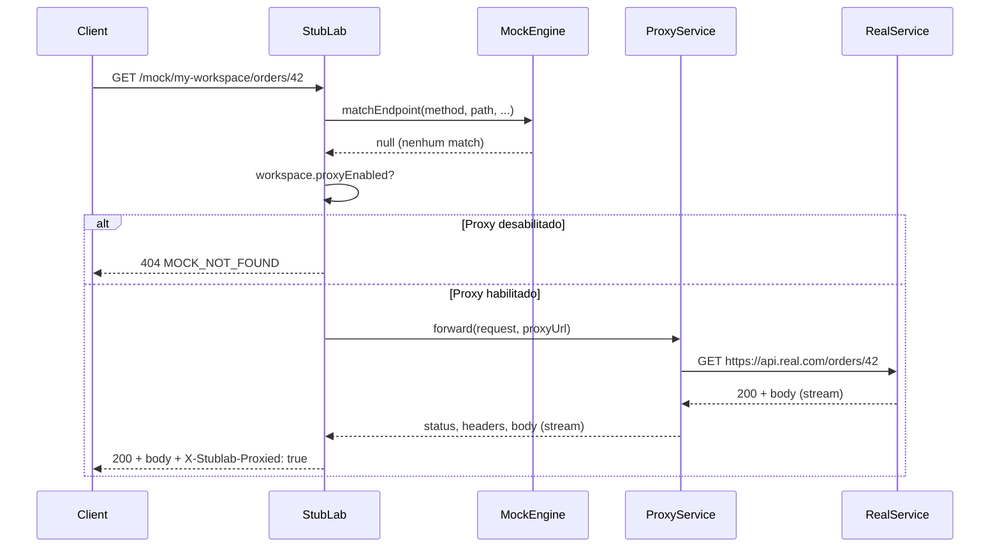

# Design — Spec 007: Proxy Mode

**Spec:** 007-proxy-mode  
**Status:** em revisao  
**Data:** 2026-04-04  
**Autor:** @architect

---

## Resumo da solucao

O proxy mode permite que workspaces encaminhem requests sem match de mock para um servico real.
A implementacao modifica o mock handler existente para, apos o algoritmo de resolucao nao
encontrar endpoint, verificar se o workspace tem proxy habilitado e fazer a chamada HTTP para
o servico real, repassando a resposta ao cliente de forma transparente.

---

## Decisao 1: Biblioteca de proxy

### Alternativas avaliadas

| Biblioteca | Pros | Contras |
|------------|------|---------|
| `undici` | Nativa do Node 18+, streaming eficiente, API moderna, baixo overhead | Requer gerenciamento manual de headers |
| `node-http-proxy` | Maduro, usado em producao ha anos | Nao suporta HTTP/2, API callback antiga |
| `http-proxy-middleware` | Integracao facil com Express | Dependencia desnecessaria (para Express), overhead |
| `axios` | Popular, facil de usar | Nao suporta streaming nativo, bufferiza body inteiro |

### Escolha: `undici`

**Por que:**
- Ja vem embutido no Node 20+ (nao adiciona dependencia externa)
- Suporte nativo a streaming de request e response via `stream.pipeline`
- API baseada em Promises que integra bem com Fastify
- Performance superior a libs que bufferizam o body inteiro
- Permite controle fino de headers (necessario para reescrita de Host, X-Forwarded-*)

A integracao com Fastify sera feita usando `undici.request()` diretamente no handler,
com streaming da response body via `reply.send(responseBody)`.

---

## Decisao 2: Estrategia de streaming

### Abordagem

1. **Request para o proxy:** Os headers e body da request original sao repassados para
   `undici.request()`. O body e um Readable stream (`request.raw`), evitando bufferizacao.

2. **Response do proxy:** O body da response e um Readable stream retornado pelo undici.
   Usamos `reply.send(body)` do Fastify que ja suporta streams.

3. **Timeout:** Configurado via `PROXY_TIMEOUT_MS` (default 10000ms). O undici tem suporte
   nativo a AbortController para cancelar requests que excedem o timeout.

### Diagrama de fluxo



---

## Decisao 3: Reescrita de headers

### Headers na REQUEST (cliente -> servico real)

| Header | Comportamento |
|--------|---------------|
| `Host` | **Reescrito** para o host da URL base do proxy (ex: `api.meuservico.com.br`) |
| `X-Forwarded-For` | **Adicionado** com o IP do cliente original (`request.ip`) |
| `X-Forwarded-Host` | **Adicionado** com o host original da request (ex: `localhost:3000`) |
| `X-Forwarded-Proto` | **Adicionado** com o protocolo original (`http` ou `https`) |
| `X-Stublab-*` | **Removidos** (headers internos nao sao repassados) |
| Demais | **Repassados** sem modificacao |

### Headers na RESPONSE (servico real -> cliente)

| Header | Comportamento |
|--------|---------------|
| `X-Stublab-Proxied` | **Adicionado** com valor `true` |
| `Transfer-Encoding` | **Preservado** (streaming) ou ajustado pelo Fastify |
| `Content-Encoding` | **Preservado** (gzip, br, etc) |
| Demais | **Repassados** sem modificacao |

### Implementacao

```typescript
function buildProxyHeaders(
  originalHeaders: Record<string, string>,
  targetUrl: URL,
  clientIp: string,
  originalHost: string,
  originalProto: string,
): Record<string, string> {
  const headers: Record<string, string> = {}

  for (const [key, value] of Object.entries(originalHeaders)) {
    const lower = key.toLowerCase()
    // Remove headers internos do StubLab
    if (lower.startsWith('x-stublab-')) continue
    // Host sera substituido
    if (lower === 'host') continue
    headers[key] = value
  }

  headers['Host'] = targetUrl.host
  headers['X-Forwarded-For'] = clientIp
  headers['X-Forwarded-Host'] = originalHost
  headers['X-Forwarded-Proto'] = originalProto

  return headers
}
```

---

## Decisao 4: Integracao com o mock engine

### Ponto de integracao

O arquivo `apps/api/src/mock/handler.ts` sera modificado. Atualmente, quando `matchEndpoint()`
retorna `null`, o handler retorna `404 MOCK_NOT_FOUND`. Com o proxy mode:

```typescript
// handler.ts (simplificado)

const matched = matchEndpoint(method, wildcardPath, queryParams, headers, body, activeEndpoints)

if (matched) {
  // Comportamento atual: responde com o mock
  return reply.status(matched.responseStatus).send(matched.responseBody)
}

// Novo: verificar proxy mode
if (isProxyEnabled() && workspace.proxyEnabled && workspace.proxyUrl) {
  const result = await ProxyService.forward({
    method,
    path: wildcardPath + queryString,
    headers: request.headers,
    body: request.raw,
    targetBaseUrl: workspace.proxyUrl,
    clientIp: request.ip,
    originalHost: request.hostname,
    originalProto: request.protocol,
    timeoutMs: getProxyTimeout(),
  })

  reply.header('X-Stublab-Proxied', 'true')
  for (const [key, value] of Object.entries(result.headers)) {
    reply.header(key, value)
  }
  return reply.status(result.status).send(result.body)
}

// Fallback: 404
return reply.status(404).send({ error: 'No mock found', code: 'MOCK_NOT_FOUND' })
```

### Nova estrutura de arquivos

```
apps/api/src/
  mock/
    handler.ts          # modificado: integra com ProxyService
    engine.ts           # sem alteracao
    rule-evaluator.ts   # sem alteracao
  services/
    proxy-service.ts    # NOVO: logica de proxy HTTP
  config/
    env.ts              # NOVO: centralizacao de variaveis de ambiente
```

---

## Decisao 5: Alteracoes no schema do banco

### Campos adicionados na tabela `workspaces`

| Campo | Tipo | Default | Descricao |
|-------|------|---------|-----------|
| `proxy_url` | `text` | `null` | URL base do servico real (ex: `https://api.meuservico.com.br`) |
| `proxy_enabled` | `integer` (boolean) | `false` | Se o proxy esta ativo para este workspace |

### Schema Drizzle atualizado

```typescript
// schema.ts
export const workspaces = sqliteTable('workspaces', {
  id: text('id').primaryKey(),
  name: text('name').notNull(),
  slug: text('slug').notNull().unique(),
  proxyUrl: text('proxy_url'),                                    // NOVO
  proxyEnabled: integer('proxy_enabled', { mode: 'boolean' })     // NOVO
    .notNull()
    .default(false),
  createdAt: text('created_at').notNull(),
  updatedAt: text('updated_at').notNull(),
})
```

### Migration

A migration sera gerada pelo Drizzle Kit. Resultado esperado:

```sql
-- 0003_add_proxy_fields.sql
ALTER TABLE workspaces ADD COLUMN proxy_url TEXT;
ALTER TABLE workspaces ADD COLUMN proxy_enabled INTEGER NOT NULL DEFAULT 0;
```

**Por que:** SQLite suporta `ALTER TABLE ADD COLUMN` mas nao `ALTER TABLE MODIFY`. Como os
novos campos tem defaults (`NULL` e `0`), a migration e segura para dados existentes.

---

## Decisao 6: Variaveis de ambiente

### Novas variaveis

| Variavel | Tipo | Default | Descricao |
|----------|------|---------|-----------|
| `PROXY_ENABLED` | `boolean` | `true` | Override global para desativar proxy em todos os workspaces |
| `PROXY_TIMEOUT_MS` | `number` | `10000` | Timeout em ms para chamadas ao servico real |

### Centralizacao em `config/env.ts`

Criar um modulo dedicado para ler variaveis de ambiente com validacao:

```typescript
// apps/api/src/config/env.ts

function parseBoolean(value: string | undefined, defaultValue: boolean): boolean {
  if (value === undefined) return defaultValue
  return value.toLowerCase() !== 'false' && value !== '0'
}

function parseNumber(value: string | undefined, defaultValue: number): number {
  if (value === undefined) return defaultValue
  const parsed = parseInt(value, 10)
  return isNaN(parsed) ? defaultValue : parsed
}

export const env = {
  proxyEnabled: parseBoolean(process.env.PROXY_ENABLED, true),
  proxyTimeoutMs: parseNumber(process.env.PROXY_TIMEOUT_MS, 10000),
  // ... outras variaveis existentes podem ser migradas para ca
} as const

export function isProxyGloballyEnabled(): boolean {
  return env.proxyEnabled
}

export function getProxyTimeoutMs(): number {
  return env.proxyTimeoutMs
}
```

### Atualizacao do .env.example

```env
# ─── Proxy Mode ─────────────────────────────────────────────────────────────
# Permite desativar proxy globalmente (util para CI offline)
PROXY_ENABLED=true

# Timeout em ms para chamadas ao servico real
PROXY_TIMEOUT_MS=10000
```

### Atualizacao do docker-compose.yml

```yaml
environment:
  # ... existentes
  PROXY_ENABLED: "${PROXY_ENABLED:-true}"
  PROXY_TIMEOUT_MS: "${PROXY_TIMEOUT_MS:-10000}"
```

---

## Decisao 7: ProxyService

### Interface

```typescript
// apps/api/src/services/proxy-service.ts

export interface ProxyRequest {
  method: string
  path: string               // inclui query string
  headers: Record<string, string>
  body: Readable | null
  targetBaseUrl: string      // ex: https://api.meuservico.com.br
  clientIp: string
  originalHost: string
  originalProto: string
  timeoutMs: number
}

export interface ProxyResponse {
  status: number
  headers: Record<string, string>
  body: Readable
}

export class ProxyServiceError extends Error {
  constructor(
    public code: 'PROXY_TIMEOUT' | 'PROXY_ERROR',
    message: string,
    public target: string,
    public reason?: string,
  ) {
    super(message)
    this.name = 'ProxyServiceError'
  }
}

export const ProxyService = {
  async forward(req: ProxyRequest): Promise<ProxyResponse> {
    // Implementacao com undici
  },
}
```

### Tratamento de erros

| Cenario | Codigo HTTP | Response body |
|---------|-------------|---------------|
| Timeout (>10s) | `504` | `{ error: "Proxy timeout", code: "PROXY_TIMEOUT", target: "..." }` |
| Connection refused | `502` | `{ error: "Proxy error", code: "PROXY_ERROR", target: "...", reason: "..." }` |
| DNS falhou | `502` | `{ error: "Proxy error", code: "PROXY_ERROR", target: "...", reason: "..." }` |
| SSL error | `502` | `{ error: "Proxy error", code: "PROXY_ERROR", target: "...", reason: "..." }` |

Em todos os erros, o header `X-Stublab-Proxied: true` e adicionado a response.

---

## Decisao 8: Validacao da URL de proxy

### Regras de validacao

1. Deve ser uma URL valida (parseable por `new URL()`)
2. Deve usar protocolo `http://` ou `https://`
3. Nao deve ter trailing slash (removido automaticamente)
4. Nao deve ter path alem da raiz (ex: `https://api.com/v1` nao e permitido - usar apenas `https://api.com`)

**Por que a restricao do path:** Simplifica a concatenacao e evita ambiguidades. O path completo
da request e sempre concatenado diretamente. Se o usuario precisar de `/v1` no path, ele deve
configurar a URL base como `https://api.com` e os endpoints mockados/proxiados terao `/v1/...`.

### Schema Zod para validacao

```typescript
const proxyUrlSchema = z.string()
  .url('URL invalida')
  .refine(
    (url) => {
      const parsed = new URL(url)
      return parsed.protocol === 'http:' || parsed.protocol === 'https:'
    },
    'Protocolo deve ser http ou https'
  )
  .refine(
    (url) => {
      const parsed = new URL(url)
      return parsed.pathname === '/' || parsed.pathname === ''
    },
    'URL nao deve conter path'
  )
  .transform((url) => url.replace(/\/$/, '')) // remove trailing slash
  .nullable()
```

---

## Decisao 9: Consideracoes de seguranca

### SSRF (Server-Side Request Forgery)

**Risco:** Um usuario malicioso poderia configurar `proxyUrl` para um servico interno
(ex: `http://localhost:9999`, `http://169.254.169.254` para metadata de cloud).

**Mitigacao nesta versao:** Nenhuma. O StubLab e uma ferramenta para ambientes de
desenvolvimento/teste onde os usuarios sao confiaveis. Documentar claramente que:
- O proxy permite acesso a qualquer URL acessivel pelo servidor StubLab
- Em ambientes compartilhados, usar `PROXY_ENABLED=false` para desativar

**Mitigacao futura (fora do escopo):**
- Allowlist/blocklist de dominios
- Bloqueio de IPs privados (RFC 1918)
- Rate limiting por workspace

### Headers internos

**Risco:** Um cliente poderia enviar `X-Stublab-Internal: true` para tentar afetar
o comportamento do sistema.

**Mitigacao:** Headers `X-Stublab-*` da request original sao removidos antes do proxy.
O StubLab so adiciona seus proprios headers na response.

### Timeout como protecao

**Beneficio:** O timeout de 10s previne que o servidor fique bloqueado indefinidamente
em caso de servico lento ou ataque de slow loris.

---

## Decisao 10: Alteracoes na API de workspaces

### Endpoints existentes modificados

#### PUT /api/workspaces/:slug

Body aceita novos campos:

```typescript
{
  name?: string
  slug?: string
  proxyUrl?: string | null    // NOVO
  proxyEnabled?: boolean      // NOVO
}
```

Response inclui novos campos:

```typescript
{
  id: string
  name: string
  slug: string
  proxyUrl: string | null     // NOVO
  proxyEnabled: boolean       // NOVO
  createdAt: string
  updatedAt: string
}
```

#### GET /api/workspaces/:slug e GET /api/workspaces

Responses incluem os novos campos `proxyUrl` e `proxyEnabled`.

### Novo endpoint

#### GET /api/config/proxy

Retorna o estado global do proxy:

```typescript
{
  globallyEnabled: boolean    // valor de PROXY_ENABLED
  timeoutMs: number           // valor de PROXY_TIMEOUT_MS
}
```

**Por que:** Permite que o frontend mostre aviso "Proxy mode desativado globalmente"
sem ter que tentar uma chamada de proxy para descobrir.

---

## Decisao 11: Alteracoes no frontend

### Componentes modificados

#### WorkspaceEditDialog

Adicionar secao "Configuracoes de Proxy":

```tsx
<div className="space-y-3 border-t pt-4">
  <h4 className="text-sm font-medium">Proxy Mode</h4>
  
  {!globalConfig.globallyEnabled && (
    <Alert variant="warning">
      Proxy mode desativado globalmente pelo administrador
    </Alert>
  )}
  
  <div className="flex items-center gap-2">
    <Switch
      checked={proxyEnabled}
      onCheckedChange={setProxyEnabled}
      disabled={!globalConfig.globallyEnabled}
    />
    <Label>Encaminhar requests sem mock para servico real</Label>
  </div>
  
  {proxyEnabled && (
    <div className="space-y-1.5">
      <Label>URL base do servico</Label>
      <Input
        placeholder="https://api.meuservico.com.br"
        value={proxyUrl}
        onChange={(e) => setProxyUrl(e.target.value)}
      />
      <p className="text-xs text-muted-foreground">
        Requests sem endpoint mockado serao encaminhadas para esta URL
      </p>
    </div>
  )}
</div>
```

#### WorkspaceSelector (header)

Adicionar badge quando proxy esta ativo:

```tsx
{workspace.proxyEnabled && workspace.proxyUrl && (
  <Badge variant="secondary" className="text-xs">
    <ArrowUpRight className="w-3 h-3 mr-1" />
    Proxy ativo
  </Badge>
)}
```

### Novos hooks

#### useProxyConfig()

```typescript
export function useProxyConfig() {
  return useQuery({
    queryKey: ['config', 'proxy'],
    queryFn: () => apiClient.get<{ globallyEnabled: boolean; timeoutMs: number }>('/config/proxy'),
  })
}
```

### Tipos atualizados

```typescript
// types/workspace.ts
export interface Workspace {
  id: string
  name: string
  slug: string
  proxyUrl: string | null      // NOVO
  proxyEnabled: boolean        // NOVO
  createdAt: string
  updatedAt: string
}

export interface UpdateWorkspaceInput {
  name?: string
  slug?: string
  proxyUrl?: string | null     // NOVO
  proxyEnabled?: boolean       // NOVO
}
```

---

## Decisao 12: Preparacao para spec de historico

Embora a spec de historico esteja fora do escopo, o modelo `RequestLog` (quando implementado)
deve incluir:

| Campo | Tipo | Descricao |
|-------|------|-----------|
| `proxied` | `boolean` | Se a request foi proxiada |
| `proxyTarget` | `string` | URL completa do destino (ex: `https://api.real.com/orders/42`) |
| `proxyStatus` | `integer` | Status retornado pelo servico real |
| `proxyDurationMs` | `integer` | Tempo da chamada ao proxy |

Isso permite filtrar e visualizar requests proxiadas vs mockadas no futuro.

---

## Riscos e mitigacoes

| Risco | Probabilidade | Impacto | Mitigacao |
|-------|---------------|---------|-----------|
| SSRF em ambiente de producao | Media | Alto | Documentar; futura spec de allowlist |
| Servico real muito lento | Media | Medio | Timeout configuravel via env |
| Body muito grande causa OOM | Baixa | Alto | Streaming evita bufferizacao |
| Certificado SSL invalido no destino | Baixa | Baixo | undici falha com erro claro |
| Proxy URL configurada errada | Alta | Baixo | Validacao Zod com mensagens claras |

---

## Testes necessarios

### Unitarios

- `ProxyService.forward()` com mock do undici
- `buildProxyHeaders()` com varios cenarios de headers
- Validacao Zod da proxyUrl (valida, invalida, com path, trailing slash)
- `config/env.ts` parsing de PROXY_ENABLED e PROXY_TIMEOUT_MS

### Integracao

- Handler retorna mock quando match existe (regressao)
- Handler retorna 404 quando proxy desabilitado e sem match
- Handler proxia quando workspace.proxyEnabled e sem match
- Handler respeita PROXY_ENABLED=false global
- Handler retorna 504 quando servico real timeout
- Handler retorna 502 quando servico real inacessivel
- Headers X-Stublab-Proxied presente em todas as responses de proxy
- Headers X-Forwarded-* corretos na request ao servico real

### E2E (manual ou futuro)

- Configurar proxy no workspace via UI
- Request sem mock vai para servico real
- Badge "Proxy ativo" aparece no header

---

## Resumo de arquivos alterados/criados

### Backend

| Arquivo | Acao |
|---------|------|
| `apps/api/src/db/schema.ts` | Modificado: adicionar campos proxy |
| `apps/api/src/db/migrations/XXXX_add_proxy_fields.sql` | Criado: migration |
| `apps/api/src/types/workspace.ts` | Modificado: adicionar campos proxy |
| `apps/api/src/services/workspace-service.ts` | Modificado: retornar campos proxy |
| `apps/api/src/services/proxy-service.ts` | Criado: logica de proxy |
| `apps/api/src/config/env.ts` | Criado: variaveis de ambiente |
| `apps/api/src/mock/handler.ts` | Modificado: integrar proxy |
| `apps/api/src/routes/workspaces/update.ts` | Modificado: aceitar campos proxy |
| `apps/api/src/routes/config/proxy.ts` | Criado: endpoint de config |
| `apps/api/src/app.ts` | Modificado: registrar nova rota |
| `.env.example` | Modificado: adicionar PROXY_* |
| `docker-compose.yml` | Modificado: adicionar PROXY_* |

### Frontend

| Arquivo | Acao |
|---------|------|
| `apps/web/src/types/workspace.ts` | Modificado: adicionar campos proxy |
| `apps/web/src/hooks/use-workspaces.ts` | Sem alteracao (tipos atualizados automaticamente) |
| `apps/web/src/hooks/use-proxy-config.ts` | Criado: hook para config global |
| `apps/web/src/components/workspace-edit-dialog.tsx` | Modificado: adicionar secao proxy |
| `apps/web/src/components/workspace-selector.tsx` | Modificado: adicionar badge proxy |

---

## Proximos passos

1. @architect revisa este design
2. Criar `tasks.md` com lista detalhada de tarefas
3. @backend-dev implementa em ordem de dependencia
4. @frontend-dev implementa UI em paralelo apos API pronta
5. @tester cria e executa testes
6. @code-reviewer faz revisao final
