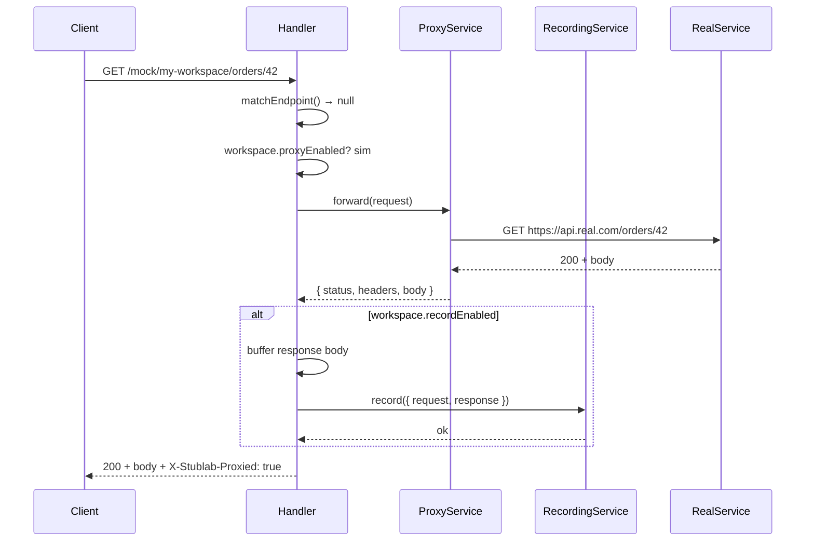

# Design — Spec 008: Record Mode

**Spec:** 008-record-mode  
**Status:** em revisao  
**Data:** 2026-04-04  
**Autor:** @architect

---

## Resumo da solucao

O record mode permite gravar automaticamente interacoes (request + response) quando o proxy mode
esta ativo. As interacoes ficam em uma fila de revisao no banco de dados. O desenvolvedor pode
revisar cada interacao, descartar o que nao quer e confirmar o que deve virar endpoint mockado.

A gravacao acontece no fluxo de proxy apos receber a resposta do servico real e antes de devolver
ao cliente. Interacoes duplicadas sao agrupadas usando hash SHA-256 dos campos relevantes.

---

## Decisao 1: Ponto de insercao do hook de gravacao

### Alternativas avaliadas

| Local | Pros | Contras |
|-------|------|---------|
| Dentro de `ProxyService.forward()` | Encapsulado, testavel isoladamente | Viola SRP — proxy nao deveria gravar |
| No `handler.ts` apos `forwardToProxy()` | Separa responsabilidades, proxy permanece puro | Precisa consumir o body stream antes de gravar |
| Middleware separado no handler | Maximo desacoplamento | Complexidade adicional desnecessaria |

### Escolha: No `handler.ts` apos `forwardToProxy()`

**Por que:**
- O `ProxyService` mantem responsabilidade unica: fazer proxy HTTP
- O `handler.ts` ja e o ponto de orquestracao que conhece workspace e contexto
- A gravacao depende de `workspace.recordEnabled` — informacao disponivel no handler
- Permite testar gravacao independentemente do proxy

### Fluxo de gravacao



### Problema: streaming vs gravacao

O `ProxyService.forward()` retorna `body` como `Readable` stream para evitar bufferizacao.
Para gravar, precisamos do body completo. Solucao:

```typescript
// No handler.ts, quando recordEnabled:
const chunks: Buffer[] = []
for await (const chunk of result.body) {
  chunks.push(chunk)
}
const bodyBuffer = Buffer.concat(chunks)
const bodyString = bodyBuffer.toString('utf-8')

// Gravar assincronamente (nao bloqueia resposta)
RecordingService.record({...}).catch(err => request.log.error(err))

// Enviar resposta ao cliente
reply.status(result.status).send(bodyBuffer)
```

**Trade-off:** Quando record mode esta ativo, o body e bufferizado em memoria.
Para bodies muito grandes (>10MB), isso pode causar pressao de memoria.

**Mitigacao:** Adicionar limite de tamanho no body gravado (ex: 1MB). Bodies maiores
sao truncados com indicador `[truncated]`.

---

## Decisao 2: Schema Drizzle para RecordedInteraction

### Campos

| Campo | Tipo SQLite | Tipo TS | Descricao |
|-------|-------------|---------|-----------|
| `id` | `TEXT` | `string` | UUID v4 |
| `workspace_id` | `TEXT` | `string` | FK para workspaces |
| `method` | `TEXT` | `string` | HTTP method |
| `path` | `TEXT` | `string` | Path incluindo query string |
| `request_headers` | `TEXT (JSON)` | `Record<string, string>` | Headers da request |
| `request_body` | `TEXT` | `string \| null` | Body da request |
| `response_status` | `INTEGER` | `number` | Status code da response |
| `response_body` | `TEXT` | `string \| null` | Body da response |
| `response_headers` | `TEXT (JSON)` | `Record<string, string>` | Headers da response filtrados |
| `captured_at` | `TEXT` | `string` | ISO timestamp da captura |
| `group_key` | `TEXT` | `string` | SHA-256 hash para agrupamento |
| `group_count` | `INTEGER` | `number` | Contador de capturas no grupo |

### Schema Drizzle

```typescript
// apps/api/src/db/schema.ts

export const recordedInteractions = sqliteTable('recorded_interactions', {
  id: text('id').primaryKey(),
  workspaceId: text('workspace_id')
    .notNull()
    .references(() => workspaces.id, { onDelete: 'cascade' }),
  method: text('method').notNull(),
  path: text('path').notNull(),
  requestHeaders: text('request_headers', { mode: 'json' }).notNull().default('{}'),
  requestBody: text('request_body'),
  responseStatus: integer('response_status').notNull(),
  responseBody: text('response_body'),
  responseHeaders: text('response_headers', { mode: 'json' }).notNull().default('{}'),
  capturedAt: text('captured_at').notNull(),
  groupKey: text('group_key').notNull(),
  groupCount: integer('group_count').notNull().default(1),
}, (table) => [
  // Por que: busca por workspace e agrupamento por groupKey sao as queries principais
  index('idx_recorded_interactions_workspace').on(table.workspaceId),
  uniqueIndex('idx_recorded_interactions_group').on(table.workspaceId, table.groupKey),
])
```

### Alteracao na tabela workspaces

```typescript
export const workspaces = sqliteTable('workspaces', {
  // ... campos existentes
  proxyUrl: text('proxy_url'),
  proxyEnabled: integer('proxy_enabled', { mode: 'boolean' }).notNull().default(false),
  recordEnabled: integer('record_enabled', { mode: 'boolean' }).notNull().default(false), // NOVO
  createdAt: text('created_at').notNull(),
  updatedAt: text('updated_at').notNull(),
})
```

---

## Decisao 3: Migration

A migration sera gerada pelo Drizzle Kit. Resultado esperado:

```sql
-- 0006_add_record_mode.sql

CREATE TABLE `recorded_interactions` (
  `id` text PRIMARY KEY NOT NULL,
  `workspace_id` text NOT NULL,
  `method` text NOT NULL,
  `path` text NOT NULL,
  `request_headers` text DEFAULT '{}' NOT NULL,
  `request_body` text,
  `response_status` integer NOT NULL,
  `response_body` text,
  `response_headers` text DEFAULT '{}' NOT NULL,
  `captured_at` text NOT NULL,
  `group_key` text NOT NULL,
  `group_count` integer DEFAULT 1 NOT NULL,
  FOREIGN KEY (`workspace_id`) REFERENCES `workspaces`(`id`) ON DELETE cascade
);

CREATE INDEX `idx_recorded_interactions_workspace` ON `recorded_interactions` (`workspace_id`);
CREATE UNIQUE INDEX `idx_recorded_interactions_group` ON `recorded_interactions` (`workspace_id`, `group_key`);

ALTER TABLE `workspaces` ADD `record_enabled` integer DEFAULT false NOT NULL;
```

**Por que indice unico em (workspace_id, group_key):**
- Permite `INSERT ... ON CONFLICT` para incrementar groupCount atomicamente
- Evita race conditions quando multiplas requests identicas chegam simultaneamente

---

## Decisao 4: Estrategia de agrupamento com SHA-256

### Campos do hash

O `groupKey` e calculado como SHA-256 de:
- `method` (uppercase)
- `path` (incluindo query string, normalizado)
- `responseStatus` (como string)
- `responseBody` (ou string vazia se null)

**Por que nao incluir request body:**
- Requests diferentes podem produzir mesma resposta (ex: GET nao tem body)
- Foco e agrupar "mesma resposta para mesmo endpoint"

**Por que incluir responseStatus:**
- GET /users pode retornar 200 ou 404 — sao cenarios diferentes que o dev pode querer mockar separadamente

### Implementacao

```typescript
import { createHash } from 'crypto'

export function computeGroupKey(
  method: string,
  path: string,
  responseStatus: number,
  responseBody: string | null,
): string {
  const hash = createHash('sha256')
  hash.update(method.toUpperCase())
  hash.update('\0') // separador
  hash.update(path)
  hash.update('\0')
  hash.update(String(responseStatus))
  hash.update('\0')
  hash.update(responseBody ?? '')
  return hash.digest('hex')
}
```

### Logica de upsert

```typescript
// RecordingService.record()

const groupKey = computeGroupKey(method, path, responseStatus, responseBody)
const now = new Date().toISOString()
const id = uuidv4()

// SQLite suporta INSERT ... ON CONFLICT
await db.insert(recordedInteractions).values({
  id,
  workspaceId,
  method,
  path,
  requestHeaders,
  requestBody,
  responseStatus,
  responseBody,
  responseHeaders,
  capturedAt: now,
  groupKey,
  groupCount: 1,
}).onConflictDoUpdate({
  target: [recordedInteractions.workspaceId, recordedInteractions.groupKey],
  set: {
    groupCount: sql`group_count + 1`,
    capturedAt: now,
    // Atualiza headers/body da request com a captura mais recente
    requestHeaders: sql`excluded.request_headers`,
    requestBody: sql`excluded.request_body`,
  },
})
```

---

## Decisao 5: Filtro de headers antes de salvar

### Headers removidos da response

| Header | Motivo |
|--------|--------|
| `transfer-encoding` | Especifico do transporte HTTP (chunked) |
| `connection` | Especifico da conexao TCP |
| `keep-alive` | Especifico da conexao |
| `x-stublab-proxied` | Header interno do StubLab |
| `x-stublab-*` | Headers internos do StubLab |
| `x-forwarded-*` | Headers de proxy — nao fazem sentido no mock |
| `content-length` | Sera recalculado pelo Fastify ao servir o mock |
| `content-encoding` | gzip/br — mock serve descomprimido |

### Headers removidos da request (para gravacao)

| Header | Motivo |
|--------|--------|
| `host` | Especifico da conexao com StubLab |
| `x-stublab-*` | Headers internos |
| `x-forwarded-*` | Headers de proxy |
| `connection` | Especifico da conexao |

### Implementacao

```typescript
const FILTERED_RESPONSE_HEADERS = new Set([
  'transfer-encoding',
  'connection',
  'keep-alive',
  'content-length',
  'content-encoding',
])

const FILTERED_REQUEST_HEADERS = new Set([
  'host',
  'connection',
])

function filterHeaders(
  headers: Record<string, string | string[]>,
  filteredSet: Set<string>,
): Record<string, string> {
  const result: Record<string, string> = {}
  for (const [key, value] of Object.entries(headers)) {
    const lower = key.toLowerCase()
    if (filteredSet.has(lower)) continue
    if (lower.startsWith('x-stublab-')) continue
    if (lower.startsWith('x-forwarded-')) continue
    result[key] = Array.isArray(value) ? value.join(', ') : value
  }
  return result
}
```

---

## Decisao 6: RecordingService

### Interface

```typescript
// apps/api/src/services/recording-service.ts

export interface RecordInteractionInput {
  workspaceId: string
  method: string
  path: string
  requestHeaders: Record<string, string>
  requestBody: string | null
  responseStatus: number
  responseBody: string | null
  responseHeaders: Record<string, string>
}

export interface RecordedInteraction {
  id: string
  workspaceId: string
  method: string
  path: string
  requestHeaders: Record<string, string>
  requestBody: string | null
  responseStatus: number
  responseBody: string | null
  responseHeaders: Record<string, string>
  capturedAt: string
  groupKey: string
  groupCount: number
}

export const RecordingService = {
  async record(input: RecordInteractionInput): Promise<void> { ... },
  
  async findByWorkspace(
    workspaceId: string,
    filters?: { method?: string; status?: number; search?: string },
    pagination?: { limit?: number; offset?: number },
  ): Promise<{ data: RecordedInteraction[]; total: number }> { ... },
  
  async findById(id: string, workspaceId: string): Promise<RecordedInteraction | null> { ... },
  
  async delete(id: string, workspaceId: string): Promise<boolean> { ... },
  
  async deleteMany(ids: string[], workspaceId: string): Promise<number> { ... },
  
  async deleteAll(workspaceId: string): Promise<number> { ... },
}
```

---

## Decisao 7: API REST para gerenciar a fila

### Rotas

| Metodo | Path | Descricao |
|--------|------|-----------|
| `GET` | `/api/workspaces/:slug/recordings` | Lista gravacoes do workspace |
| `GET` | `/api/workspaces/:slug/recordings/:id` | Detalhe de uma gravacao |
| `DELETE` | `/api/workspaces/:slug/recordings/:id` | Remove uma gravacao |
| `DELETE` | `/api/workspaces/:slug/recordings` | Remove todas (com query `?all=true`) |
| `POST` | `/api/workspaces/:slug/recordings/discard` | Descarta multiplas `{ ids: string[] }` |
| `POST` | `/api/workspaces/:slug/recordings/:id/save` | Salva como mock (abre dialog no frontend) |
| `POST` | `/api/workspaces/:slug/recordings/save-bulk` | Salva multiplas como mocks |

### GET /api/workspaces/:slug/recordings

**Query params:**
- `method?: string` — filtrar por metodo
- `status?: number` — filtrar por response status
- `search?: string` — buscar no path
- `limit?: number` — default 50, max 100
- `offset?: number` — default 0

**Response:**
```typescript
{
  data: RecordedInteraction[]
  total: number
  limit: number
  offset: number
}
```

### POST /api/workspaces/:slug/recordings/:id/save

**Body (opcional — para pre-preencher com alteracoes):**
```typescript
{
  name?: string
  delay?: number
}
```

**Response:**
```typescript
// Endpoint criado
{
  endpoint: Endpoint
  recordingDeleted: true
}
```

**Erros:**
- `404 RECORDING_NOT_FOUND` — gravacao nao existe
- `409 ENDPOINT_CONFLICT` — ja existe mock para method+path (retorna `existingEndpointId`)

### POST /api/workspaces/:slug/recordings/save-bulk

**Body:**
```typescript
{
  ids: string[]
  skipConflicts?: boolean // default true — ignora conflitos ao inves de falhar
}
```

**Response:**
```typescript
{
  created: number        // quantos mocks criados
  skipped: number        // quantos ignorados por conflito
  deleted: number        // quantas gravacoes removidas
  errors: string[]       // detalhes de erros (se houver)
}
```

---

## Decisao 8: Integracao com endpoint CRUD para "salvar como mock"

### Rota POST /api/workspaces/:slug/recordings/:id/save

Quando o usuario confirma "Salvar como mock":

1. Busca a gravacao pelo ID
2. Verifica se ja existe endpoint ativo com mesmo method+path
   - Se existe e `overwrite=false` (default), retorna 409 com `existingEndpointId`
   - Se `overwrite=true`, desativa o endpoint existente antes de criar
3. Cria endpoint via `EndpointService.create()`:
   ```typescript
   {
     workspaceId,
     name: body.name ?? `${method} ${path}`,
     method,
     path,
     responseStatus,
     responseBody: responseBody ?? '{}',
     responseHeaders,
     delay: body.delay ?? 0,
     matchingRules: [], // sem regras — fallback
   }
   ```
4. Remove a gravacao da fila
5. Retorna o endpoint criado

### Tratamento de conflito no frontend

Quando API retorna 409:
1. Mostrar dialog: "Ja existe um mock para {method} {path}. Deseja sobrescrever?"
2. Se sim, reenviar request com `overwrite=true`
3. Se nao, cancelar

---

## Decisao 9: Alteracoes no workspace service e rotas

### WorkspaceService

Adicionar `recordEnabled` ao retorno de `rowToWorkspace()` e aceitar no `update()`.

### PUT /api/workspaces/:slug

Body aceita novo campo:
```typescript
{
  // ... existentes
  recordEnabled?: boolean
}
```

Validacao:
- Se `recordEnabled=true` e `proxyEnabled=false`, retornar erro:
  `"Record mode requer proxy mode ativo"`

---

## Decisao 10: Consideracoes de performance

### Fila pode crescer indefinidamente

**Problema:** Em uso intenso, a fila de gravacoes pode acumular milhares de registros.

**Mitigacoes implementadas:**
1. **Paginacao na API:** Default 50, max 100 por pagina
2. **Indice no workspace_id:** Queries filtradas por workspace sao eficientes
3. **Agrupamento:** Interacoes identicas incrementam contador ao inves de criar linhas

**Mitigacoes futuras (fora do escopo):**
- Limite maximo de gravacoes por workspace (ex: 1000)
- Limpeza automatica de gravacoes antigas (ex: > 7 dias)
- Compactacao de response bodies grandes

### Body grande na gravacao

**Problema:** Response body de 10MB bufferizado em memoria.

**Mitigacao:** Truncar body > 1MB:
```typescript
const MAX_BODY_SIZE = 1024 * 1024 // 1MB

function truncateBody(body: string | null): string | null {
  if (!body) return body
  if (body.length <= MAX_BODY_SIZE) return body
  return body.slice(0, MAX_BODY_SIZE) + '\n[truncated]'
}
```

### Gravacao assincrona

A gravacao nao deve bloquear a resposta ao cliente:
```typescript
// handler.ts
RecordingService.record({...})
  .catch(err => request.log.error({ err }, 'Falha ao gravar interacao'))

reply.status(result.status).send(bodyBuffer)
```

---

## Decisao 11: Alteracoes no frontend

### Novos componentes

| Componente | Descricao |
|------------|-----------|
| `RecordingsTab` | Aba "Gravacoes" na pagina de workspace |
| `RecordingTable` | Tabela de gravacoes com selecao |
| `RecordingDetailDialog` | Dialog para visualizar detalhes de uma gravacao |
| `RecordingSaveDialog` | Dialog de confirmacao ao salvar como mock |

### Alteracoes em componentes existentes

| Componente | Alteracao |
|------------|-----------|
| `WorkspaceEditDialog` | Adicionar toggle `recordEnabled` (desabilitado se proxy off) |
| `WorkspaceSelector` | Adicionar badge "Gravando" (vermelho) quando record mode ativo |
| `EndpointsList` | Adicionar navegacao para aba de gravacoes |

### Nova pagina: /workspaces/:slug/recordings

Usar mesma estrutura de `EndpointsList`:
- Header com `WorkspaceSelector` e badge "Gravando"
- Filtros por metodo, status, busca
- Tabela com selecao multipla
- Acoes: visualizar, descartar, salvar como mock
- Bulk actions: descartar selecionados, salvar selecionados

### Toggle recordEnabled no WorkspaceEditDialog

```tsx
<div className="space-y-3">
  <h4 className="text-sm font-medium">Record Mode</h4>
  
  <div className="flex items-center gap-2">
    <Switch
      id="record-enabled"
      checked={recordEnabled}
      onCheckedChange={setRecordEnabled}
      disabled={!proxyEnabled}
    />
    <Label htmlFor="record-enabled" className="text-sm">
      Gravar interacoes proxiadas para revisao
    </Label>
  </div>
  
  {!proxyEnabled && (
    <p className="text-xs text-muted-foreground">
      Ative o proxy mode primeiro para habilitar gravacao
    </p>
  )}
</div>
```

### Badge "Gravando" no WorkspaceSelector

```tsx
{workspace.recordEnabled && (
  <Badge variant="destructive" className="text-xs gap-1">
    <Circle className="w-2 h-2 fill-current animate-pulse" />
    Gravando
  </Badge>
)}
```

### RecordingSaveDialog

Dialog pre-preenchido com dados da gravacao:

```tsx
<Dialog>
  <DialogHeader>
    <DialogTitle>Salvar como mock</DialogTitle>
  </DialogHeader>
  
  <div className="space-y-4">
    <div>
      <Label>Nome do endpoint</Label>
      <Input value={name} onChange={e => setName(e.target.value)} />
    </div>
    
    <div className="grid grid-cols-2 gap-4">
      <div>
        <Label>Metodo</Label>
        <Input value={recording.method} disabled />
      </div>
      <div>
        <Label>Path</Label>
        <Input value={recording.path} disabled />
      </div>
    </div>
    
    <div>
      <Label>Status da resposta</Label>
      <Input value={recording.responseStatus} disabled />
    </div>
    
    <div>
      <Label>Body da resposta</Label>
      <JsonEditor value={responseBody} onChange={setResponseBody} />
    </div>
    
    <div>
      <Label>Delay (ms)</Label>
      <Input type="number" value={delay} onChange={e => setDelay(+e.target.value)} />
    </div>
  </div>
  
  <DialogFooter>
    <Button variant="outline" onClick={onClose}>Cancelar</Button>
    <Button onClick={handleSave}>Salvar como mock</Button>
  </DialogFooter>
</Dialog>
```

---

## Decisao 12: Estrutura de arquivos

### Backend

| Arquivo | Acao |
|---------|------|
| `apps/api/src/db/schema.ts` | Modificado: adicionar `recordedInteractions` e `recordEnabled` |
| `apps/api/drizzle/0006_*.sql` | Criado: migration |
| `apps/api/src/types/recording.ts` | Criado: tipos TypeScript |
| `apps/api/src/types/workspace.ts` | Modificado: adicionar `recordEnabled` |
| `apps/api/src/services/recording-service.ts` | Criado: logica de gravacao |
| `apps/api/src/services/workspace-service.ts` | Modificado: incluir `recordEnabled` |
| `apps/api/src/mock/handler.ts` | Modificado: hook de gravacao |
| `apps/api/src/routes/workspaces/update.ts` | Modificado: aceitar `recordEnabled` |
| `apps/api/src/routes/recordings/list.ts` | Criado |
| `apps/api/src/routes/recordings/get.ts` | Criado |
| `apps/api/src/routes/recordings/delete.ts` | Criado |
| `apps/api/src/routes/recordings/discard.ts` | Criado |
| `apps/api/src/routes/recordings/save.ts` | Criado |
| `apps/api/src/routes/recordings/save-bulk.ts` | Criado |
| `apps/api/src/app.ts` | Modificado: registrar rotas de recordings |

### Frontend

| Arquivo | Acao |
|---------|------|
| `apps/web/src/types/recording.ts` | Criado |
| `apps/web/src/types/workspace.ts` | Modificado: adicionar `recordEnabled` |
| `apps/web/src/hooks/use-recordings.ts` | Criado |
| `apps/web/src/pages/recordings-list.tsx` | Criado |
| `apps/web/src/components/recording-table.tsx` | Criado |
| `apps/web/src/components/recording-detail-dialog.tsx` | Criado |
| `apps/web/src/components/recording-save-dialog.tsx` | Criado |
| `apps/web/src/components/workspace-edit-dialog.tsx` | Modificado: toggle recordEnabled |
| `apps/web/src/components/workspace-selector.tsx` | Modificado: badge "Gravando" |
| `apps/web/src/App.tsx` | Modificado: rota /workspaces/:slug/recordings |

---

## Riscos e mitigacoes

| Risco | Probabilidade | Impacto | Mitigacao |
|-------|---------------|---------|-----------|
| Fila cresce indefinidamente | Media | Medio | Paginacao; spec futura de limite |
| Body grande causa OOM | Baixa | Alto | Truncar em 1MB |
| Race condition no agrupamento | Baixa | Baixo | Indice unico + ON CONFLICT |
| Performance degradada com muitas gravacoes | Media | Medio | Indices; gravacao assincrona |
| Dados sensiveis gravados | Media | Alto | Documentar; spec futura de redaction |

---

## Testes necessarios

### Unitarios

- `computeGroupKey()` com varios inputs
- `filterHeaders()` para request e response
- `truncateBody()` com body pequeno e grande
- `RecordingService.record()` com upsert

### Integracao

- Handler grava quando record mode ativo
- Handler nao grava quando record mode inativo
- Agrupamento incrementa contador
- Rotas CRUD de recordings
- Salvar como mock cria endpoint corretamente
- Conflito de endpoint detectado e tratado
- Bulk save ignora conflitos corretamente

### Frontend

- Toggle recordEnabled desabilitado quando proxy off
- Badge "Gravando" aparece quando ativo
- Tabela de gravacoes renderiza corretamente
- Dialog de save pre-preenche campos
- Bulk actions funcionam

---

## Proximos passos

1. @architect revisa este design
2. Criar `tasks.md` com lista detalhada de tarefas
3. @backend-dev implementa em ordem de dependencia
4. @frontend-dev implementa UI apos API pronta
5. @tester cria e executa testes
6. @code-reviewer faz revisao final
