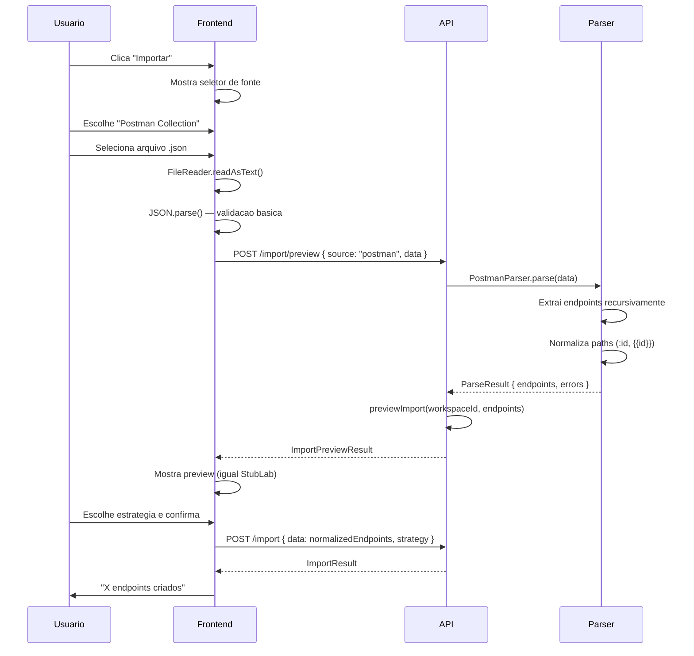
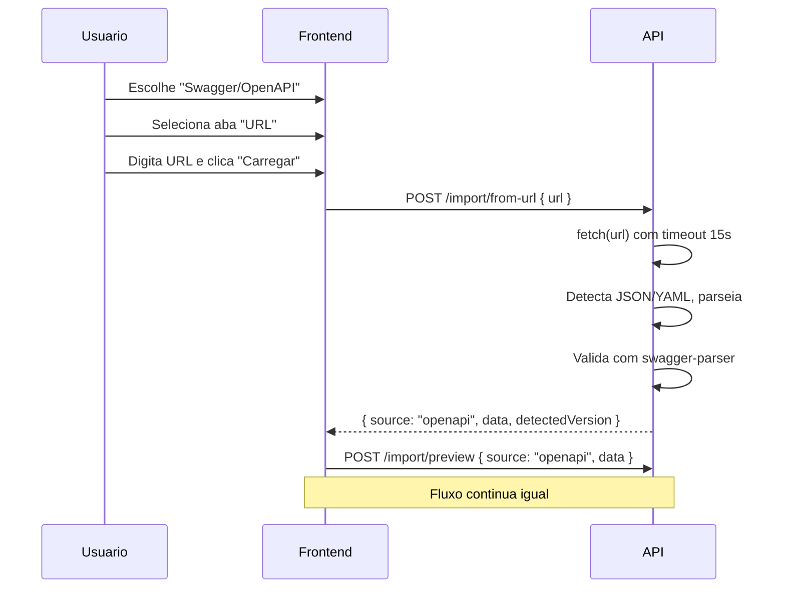

# Design — Spec 009: Import de Postman e Swagger/OpenAPI

**Status:** aguardando aprovacao  
**Autor:** @architect  
**Criado em:** 2026-04-05  
**Baseado em:** requirements.md v1

---

## Resumo da solucao

Estender o sistema de import existente (Spec 004) com suporte a dois novos formatos:

1. **Postman Collection v2/v2.1** — parsing manual sem dependencia externa
2. **Swagger/OpenAPI 2.0, 3.0.x, 3.1.x** — parsing via `@apidevtools/swagger-parser`

A arquitetura usa **Strategy Pattern** para isolar a logica de parsing por fonte. O frontend
ganha um seletor de fonte no inicio do fluxo de import, mantendo o preview e estrategia de
conflito existentes.

### Alternativas descartadas

| Alternativa | Motivo do descarte |
|-------------|-------------------|
| Lib externa para Postman (postman-collection) | Overkill — o JSON do Postman e simples e bem documentado. A lib adiciona 2MB+ de dependencias para parsing que pode ser feito em ~100 linhas |
| Converter tudo para OpenAPI antes de processar | Complexidade desnecessaria — cada formato tem mapeamento direto para Endpoint StubLab |
| Criar novos endpoints de API por fonte | Fragmenta a API. Melhor usar source type no body e reutilizar preview/import existentes |
| Suportar Postman v1 | Formato descontinuado desde 2016. Usuarios devem exportar como v2.1 |
| json-schema-faker para geracao de exemplos | Dependencia pesada (~500KB). A geracao de exemplo e simples o suficiente para implementar manualmente |

---

## Arquitetura de Parsers — Strategy Pattern

```
ImportSource (union type)
  |
  +-- 'stublab'  --> StubLabParser (existente, parse trivial)
  |
  +-- 'postman'  --> PostmanParser
  |
  +-- 'openapi'  --> OpenApiParser
```

Cada parser implementa a interface:

```typescript
interface ExternalParser {
  parse(content: unknown): ParseResult
}

interface ParseResult {
  success: boolean
  endpoints: ExportedEndpoint[]  // formato StubLab normalizado
  errors: ParseError[]
}

interface ParseError {
  message: string
  path?: string  // JSONPath do erro, se disponivel
}
```

### Por que Strategy Pattern

1. **Isolamento de responsabilidades** — cada parser conhece apenas seu formato
2. **Testabilidade** — parsers podem ser testados unitariamente com fixtures
3. **Extensibilidade** — adicionar RAML, AsyncAPI etc. no futuro e so criar novo parser
4. **Reuso** — o fluxo de preview/import existente nao muda, so recebe endpoints normalizados

---

## Biblioteca para OpenAPI

**Escolha: `@apidevtools/swagger-parser` (v10.x)**

| Criterio | Avaliacao |
|----------|-----------|
| Tamanho | ~150KB minified (aceitavel) |
| Manutencao | Ativa, 3M+ downloads/semana |
| Suporte a versoes | Swagger 2.0, OpenAPI 3.0.x, 3.1.x |
| Funcionalidades | Valida, dereferencia $ref, normaliza para objeto JS |

**Por que nao `swagger2openapi`:**  
O @apidevtools/swagger-parser ja suporta Swagger 2.0 nativamente e faz a conversao interna.
Usar duas libs para o mesmo fim adiciona complexidade.

**Por que nao parsing manual:**  
OpenAPI tem $ref, allOf, oneOf, anyOf, discriminators. Resolver tudo manualmente e
propenso a bugs e custaria semanas de desenvolvimento.

---

## Parsing de Postman Collection

Parsing manual, sem biblioteca externa. O formato Postman Collection v2.1 e JSON bem
documentado: https://schema.postman.com/collection/json/v2.1.0/draft-07/collection.json

### Estrutura relevante do Postman

```typescript
interface PostmanCollection {
  info: {
    name: string
    schema: string  // deve conter "v2" para validar versao
  }
  item: PostmanItem[]
}

interface PostmanItem {
  name: string
  request?: PostmanRequest  // ausente se for folder
  item?: PostmanItem[]      // presente se for folder
}

interface PostmanRequest {
  method: string
  url: PostmanUrl | string
}

interface PostmanUrl {
  raw?: string
  path?: string[]
  host?: string[]
}
```

### Algoritmo de extracao

```
function extractFromPostman(collection):
  endpoints = []
  queue = [...collection.item]
  
  while queue is not empty:
    item = queue.shift()
    
    if item.item:  // e uma folder
      queue.push(...item.item)
      continue
    
    if item.request:
      endpoint = {
        name: item.name || generateName(item.request.method, path),
        method: item.request.method.toUpperCase(),
        path: extractPath(item.request.url),
        responseStatus: 200,
        responseBody: '{}',
        responseHeaders: {},
        delay: 0,
        active: true,
        matchingRules: [],
      }
      endpoints.push(endpoint)
  
  return endpoints
```

### Extracao de path

```typescript
function extractPath(url: PostmanUrl | string): string {
  if (typeof url === 'string') {
    return normalizePath(url)
  }
  
  if (url.path && Array.isArray(url.path)) {
    // url.path = ['users', ':id', 'orders']
    return '/' + url.path.join('/')
  }
  
  if (url.raw) {
    return normalizePath(url.raw)
  }
  
  return '/'
}

function normalizePath(raw: string): string {
  // Remove protocolo e host
  const withoutHost = raw.replace(/^https?:\/\/[^/]+/, '')
  // Remove query string
  const withoutQuery = withoutHost.split('?')[0]
  // Remove variaveis Postman
  const withoutVars = withoutQuery.replace(/\{\{[^}]+\}\}/g, '')
  // Normaliza path params: {{id}} -> :id ja removido, :id permanece
  const withParams = withoutVars.replace(/\{([^}]+)\}/g, ':$1')
  // Garante que comeca com /
  return withParams.startsWith('/') ? withParams : '/' + withParams
}
```

---

## Parsing de OpenAPI

### Fluxo

1. Detectar se e JSON ou YAML (tentar JSON.parse primeiro, fallback para yaml.parse)
2. Chamar `SwaggerParser.validate()` — valida e dereferencia $ref
3. Iterar sobre `spec.paths` extraindo cada operacao
4. Gerar responseBody a partir do schema (US-05)

### Estrutura OpenAPI relevante

```typescript
// Apos dereferenciamento
interface OpenApiSpec {
  openapi?: string  // "3.0.0", "3.1.0"
  swagger?: string  // "2.0"
  paths: {
    [path: string]: {
      [method: string]: OpenApiOperation
    }
  }
}

interface OpenApiOperation {
  operationId?: string
  summary?: string
  responses?: {
    [statusCode: string]: OpenApiResponse
  }
}

interface OpenApiResponse {
  content?: {
    [mediaType: string]: {
      schema?: OpenApiSchema
      example?: unknown
      examples?: Record<string, { value: unknown }>
    }
  }
  // Swagger 2.0
  schema?: OpenApiSchema
  examples?: Record<string, unknown>
}
```

### Algoritmo de extracao

```
function extractFromOpenApi(spec):
  endpoints = []
  
  for path in spec.paths:
    for method in spec.paths[path]:
      if method in ['get', 'post', 'put', 'patch', 'delete']:
        operation = spec.paths[path][method]
        
        // Encontrar primeiro status 2xx
        status = findFirstSuccessStatus(operation.responses) || 200
        response = operation.responses?.[status]
        
        endpoint = {
          name: operation.operationId || `${method.toUpperCase()} ${path}`,
          method: method.toUpperCase(),
          path: normalizeOpenApiPath(path),
          responseStatus: parseInt(status),
          responseBody: generateResponseBody(response),
          responseHeaders: inferHeaders(response),
          delay: 0,
          active: true,
          matchingRules: [],
        }
        endpoints.push(endpoint)
  
  return endpoints
```

---

## Geracao de responseBody (US-05)

### Prioridade de fontes

1. `example` explicito no content/schema
2. `examples` (primeiro valor)
3. Schema com `properties` — gerar exemplo recursivo
4. Fallback: `{}`

### Algoritmo de geracao a partir de schema

```typescript
function generateFromSchema(schema: OpenApiSchema, depth = 0): unknown {
  const MAX_DEPTH = 3
  if (depth > MAX_DEPTH) return null
  
  // Exemplo explicito tem prioridade
  if (schema.example !== undefined) return schema.example
  
  switch (schema.type) {
    case 'string':
      if (schema.enum) return schema.enum[0]
      if (schema.format === 'date') return '2026-01-01'
      if (schema.format === 'date-time') return '2026-01-01T00:00:00Z'
      if (schema.format === 'email') return 'user@example.com'
      if (schema.format === 'uuid') return '00000000-0000-0000-0000-000000000000'
      return 'string'
    
    case 'integer':
    case 'number':
      if (schema.enum) return schema.enum[0]
      if (schema.minimum !== undefined) return schema.minimum
      return 0
    
    case 'boolean':
      return false
    
    case 'array':
      if (schema.items) {
        const item = generateFromSchema(schema.items, depth + 1)
        return item !== null ? [item] : []
      }
      return []
    
    case 'object':
      if (schema.properties) {
        const obj: Record<string, unknown> = {}
        for (const [key, propSchema] of Object.entries(schema.properties)) {
          obj[key] = generateFromSchema(propSchema, depth + 1)
        }
        return obj
      }
      return {}
    
    default:
      // allOf, oneOf, anyOf — usar primeiro schema disponivel
      if (schema.allOf?.[0]) return generateFromSchema(schema.allOf[0], depth)
      if (schema.oneOf?.[0]) return generateFromSchema(schema.oneOf[0], depth)
      if (schema.anyOf?.[0]) return generateFromSchema(schema.anyOf[0], depth)
      return null
  }
}
```

### Exemplo de geracao

Schema OpenAPI:
```yaml
type: object
properties:
  id:
    type: integer
  name:
    type: string
  email:
    type: string
    format: email
  tags:
    type: array
    items:
      type: string
```

Resultado gerado:
```json
{
  "id": 0,
  "name": "string",
  "email": "user@example.com",
  "tags": ["string"]
}
```

---

## Normalizacao de Path Params

| Fonte | Entrada | Saida StubLab |
|-------|---------|---------------|
| Postman | `/users/:id` | `/users/:id` |
| Postman | `/users/{{id}}` | `/users/:id` |
| OpenAPI | `/users/{id}` | `/users/:id` |

```typescript
function normalizePathParams(path: string): string {
  // OpenAPI: {param} -> :param
  let normalized = path.replace(/\{([^}]+)\}/g, ':$1')
  // Postman vars: {{param}} -> :param
  normalized = normalized.replace(/\{\{([^}]+)\}\}/g, ':$1')
  return normalized
}
```

---

## Mudancas na API

### Opcao 1: Novos endpoints por fonte (DESCARTADA)

- POST /endpoints/import/postman
- POST /endpoints/import/openapi

**Problema:** Fragmenta a API, duplica logica de preview/estrategia.

### Opcao 2: Parametro `source` no endpoint existente (ESCOLHIDA)

Reutilizar os endpoints existentes, adicionando campo `source` no body:

**POST /endpoints/import/preview**

Request (antes — formato StubLab):
```json
{
  "data": {
    "version": "1",
    "endpoints": [...]
  }
}
```

Request (novo — com source):
```json
{
  "source": "stublab" | "postman" | "openapi",
  "data": <conteudo do arquivo>
}
```

Para `source: "stublab"`, `data` continua sendo o ExportFile.
Para `source: "postman"`, `data` e o JSON da Postman Collection.
Para `source: "openapi"`, `data` e o conteudo parseado (JSON ou YAML convertido para objeto).

**Por que passar o conteudo ja parseado no `data`:**  
- JSON e parseado no frontend para validacao minima
- YAML precisa ser convertido no frontend (lib `js-yaml` ja usada em muitos projetos)
- O backend recebe sempre um objeto JS, simplificando a API

### Novo endpoint: POST /endpoints/import/from-url

Para US-04 (import via URL publica):

```json
{
  "url": "https://api.example.com/openapi.yaml"
}
```

**Response 200:**
```json
{
  "source": "openapi",
  "data": { ... },  // conteudo parseado
  "detectedVersion": "3.0.3"
}
```

**Erros:**
| Status | code | Quando |
|--------|------|--------|
| 400 | INVALID_URL | URL mal formada |
| 400 | FETCH_FAILED | Timeout ou erro de rede |
| 400 | INVALID_CONTENT | Conteudo nao e OpenAPI valido |
| 400 | UNSUPPORTED_VERSION | Versao OpenAPI nao suportada |

**Por que nao reutilizar /import/preview para fetch:**  
Separar responsabilidades. O fetch pode falhar de varias formas (timeout, SSL, etc.)
e retornar erros especificos. O preview ja tem seu conjunto de erros de validacao.

---

## Schemas Zod atualizados

### Arquivo: `apps/api/src/schemas/import-external.ts` (novo)

```typescript
import { z } from 'zod'

export const importSourceSchema = z.enum(['stublab', 'postman', 'openapi'])
export type ImportSource = z.infer<typeof importSourceSchema>

// Schema loose para aceitar qualquer objeto — validacao detalhada no parser
export const externalImportPreviewBodySchema = z.object({
  source: importSourceSchema,
  data: z.unknown(),
})

export const fetchOpenApiBodySchema = z.object({
  url: z.string().url(),
})

// Validacao de Postman Collection (estrutura minima)
export const postmanCollectionSchema = z.object({
  info: z.object({
    name: z.string().optional(),
    schema: z.string(),  // deve conter "v2"
  }),
  item: z.array(z.unknown()),
})

export type PostmanCollection = z.infer<typeof postmanCollectionSchema>
```

### Atualizacao em `apps/api/src/schemas/import-export.ts`

```typescript
// Adicionar ao schema existente
export const importPreviewBodySchema = z.union([
  // Formato atual (StubLab direto, sem source explicito — retrocompativel)
  z.object({ data: looseExportFileSchema }),
  // Novo formato com source
  z.object({
    source: z.enum(['stublab', 'postman', 'openapi']),
    data: z.unknown(),
  }),
])
```

---

## Estrutura de arquivos novos

### Backend

```
apps/api/src/
  schemas/
    import-external.ts           # Schemas para Postman/OpenAPI
  services/
    parsers/
      index.ts                   # Factory e interface ParseResult
      postman-parser.ts          # PostmanParser
      openapi-parser.ts          # OpenApiParser
      schema-example-generator.ts # Geracao de exemplo a partir de schema
  routes/endpoints/
    import-from-url.ts           # POST /endpoints/import/from-url
```

### Frontend

```
apps/web/src/
  components/
    import-source-selector.tsx   # Radio buttons para escolher fonte
  lib/
    yaml-parser.ts               # Wrapper para js-yaml (lazy load)
  types/
    import-external.ts           # Tipos para Postman/OpenAPI
```

---

## Fluxo de Import — Diagrama



### Fluxo alternativo: Import via URL



---

## Alteracoes no Frontend

### ImportModal — novo estado inicial

```typescript
type ModalState = 
  | 'selecting-source'  // NOVO: escolhe StubLab/Postman/OpenAPI
  | 'uploading'
  | 'loading-url'       // NOVO: aguardando fetch de URL
  | 'previewing'
  | 'importing'
  | 'done'
  | 'error'
```

### ImportSourceSelector (novo componente)

```tsx
interface ImportSourceSelectorProps {
  value: ImportSource
  onChange: (source: ImportSource) => void
}

export function ImportSourceSelector({ value, onChange }: ImportSourceSelectorProps) {
  return (
    <div className="grid gap-3">
      <SourceOption
        id="stublab"
        selected={value === 'stublab'}
        onSelect={() => onChange('stublab')}
        icon={<FileJson />}
        title="StubLab (.json)"
        description="Arquivo exportado pelo StubLab"
      />
      <SourceOption
        id="postman"
        selected={value === 'postman'}
        onSelect={() => onChange('postman')}
        icon={<Send />}
        title="Postman Collection (.json)"
        description="Colecao exportada do Postman v2.x"
      />
      <SourceOption
        id="openapi"
        selected={value === 'openapi'}
        onSelect={() => onChange('openapi')}
        icon={<FileCode />}
        title="Swagger/OpenAPI (.json/.yaml)"
        description="Spec OpenAPI 2.0, 3.0.x ou 3.1.x"
      />
    </div>
  )
}
```

### ImportPreviewTable — mostrar responseBody expandivel

Adicionar funcionalidade de expandir linha para ver o responseBody gerado:

```tsx
// Prop adicional
interface ImportPreviewTableProps {
  preview: ImportPreviewItem[]
  endpoints?: ExportedEndpoint[]  // NOVO: endpoints normalizados com responseBody
}

// Na linha expandida
{expanded && endpoints?.[item.index] && (
  <tr>
    <td colSpan={6} className="p-4 bg-muted/50">
      <JsonEditor
        value={endpoints[item.index].responseBody}
        onChange={() => {}}
        readOnly
        minHeight={100}
        maxHeight={200}
      />
    </td>
  </tr>
)}
```

---

## Dependencias novas

### Backend

```bash
pnpm add @apidevtools/swagger-parser
pnpm add -D @types/js-yaml  # swagger-parser ja traz js-yaml
```

### Frontend

```bash
pnpm add js-yaml
pnpm add -D @types/js-yaml
```

**Por que js-yaml no frontend:**  
O usuario pode fazer upload de arquivo YAML. Converter para objeto JS no frontend
antes de enviar simplifica o backend (sempre recebe objeto).

**Alternativa considerada:** Enviar raw text e detectar no backend.
Descartada porque YAML parsing no Node e trivial, mas centralizar no frontend
evita duplicar logica de deteccao de formato.

---

## Validacao e Mensagens de Erro (US-07)

### Tabela de erros por fonte

| Fonte | Condicao | Mensagem |
|-------|----------|----------|
| Todos | JSON/YAML invalido | "Arquivo invalido: erro de sintaxe na linha X" |
| Todos | Arquivo > 10MB | "Arquivo muito grande. O tamanho maximo e 10MB." |
| Postman | Schema nao contem "v2" | "Formato nao reconhecido. Use Postman Collection v2.x" |
| Postman | Nenhum request encontrado | "Nenhum endpoint encontrado. Verifique se a colecao contem requests." |
| OpenAPI | Versao nao suportada | "Versao OpenAPI X.X nao suportada. Versoes aceitas: 2.0, 3.0.x, 3.1.x" |
| OpenAPI | paths vazio | "Nenhum endpoint encontrado. Verifique se a spec define paths." |
| URL | Timeout | "Falha ao carregar URL: tempo limite excedido (15s)" |
| URL | Erro de rede | "Falha ao carregar URL: erro de conexao" |
| URL | Conteudo invalido | "O conteudo da URL nao e uma spec OpenAPI valida" |

### Deteccao de formato

```typescript
function detectSource(content: unknown): ImportSource | null {
  if (typeof content !== 'object' || content === null) return null
  
  const obj = content as Record<string, unknown>
  
  // StubLab: tem version e endpoints
  if ('version' in obj && 'endpoints' in obj) return 'stublab'
  
  // Postman: tem info.schema com "v2"
  if ('info' in obj && 'item' in obj) {
    const info = obj.info as Record<string, unknown>
    if (typeof info.schema === 'string' && info.schema.includes('v2')) {
      return 'postman'
    }
  }
  
  // OpenAPI: tem openapi ou swagger
  if ('openapi' in obj || 'swagger' in obj) return 'openapi'
  
  return null
}
```

---

## O que NAO muda

| Arquivo/Componente | Motivo |
|-------------------|--------|
| db/schema.ts | Nenhuma alteracao de schema — import gera endpoints no formato existente |
| ImportExportService.executeImport() | Reutilizado sem alteracao — recebe endpoints normalizados |
| ImportExportService.exportEndpoints() | Nao afetado |
| mock/engine.ts, mock/handler.ts | Nao afetado |
| endpoint-form.tsx | Nao afetado |

---

## Riscos e Mitigacoes

| Risco | Impacto | Mitigacao |
|-------|---------|-----------|
| Postman Collection muito aninhada (folders dentro de folders) | Baixo | Extracao recursiva com limite de 10 niveis |
| Schema OpenAPI com $ref circular | Medio | swagger-parser resolve, mas geracao de exemplo limita profundidade a 3 |
| YAML com tabs ao inves de espacos | Baixo | js-yaml e tolerante, mas logar warning |
| URL OpenAPI retorna HTML (pagina de login) | Medio | Validar que conteudo comeca com `{` ou `openapi:` |
| Arquivo grande (>5MB) trava browser | Alto | Validar tamanho no onChange do input file antes de ler |
| Postman Collection v1 enviada | Baixo | Mensagem clara: "Use Postman Collection v2.x" |

---

## Compatibilidade e Retrocompatibilidade

### API

- POST /import/preview aceita o formato antigo (sem `source`) para retrocompatibilidade
- Quando `source` e omitido, assume `stublab`
- Novos campos sao opcionais

### Frontend

- O modal comeca em `selecting-source` agora
- Usuarios acostumados com o fluxo antigo precisam de um clique extra (escolher fonte)
- Alternativa considerada: detectar automaticamente pelo conteudo do arquivo
  - Descartada: pode confundir se deteccao errar, melhor usuario escolher explicitamente

---

## Testes necessarios

### Backend — Parsers

| Teste | Fixture |
|-------|---------|
| Postman v2.1 com folders aninhadas | postman-nested.json |
| Postman com variaveis {{baseUrl}} | postman-variables.json |
| OpenAPI 2.0 (Swagger) | swagger-2.0.json |
| OpenAPI 3.0.3 com $ref | openapi-3.0-refs.json |
| OpenAPI 3.1.0 com examples | openapi-3.1-examples.yaml |
| Schema com allOf/oneOf | openapi-complex-schema.json |
| Geracao de exemplo recursiva | (coberto acima) |

### Backend — Rotas

| Teste | Cenario |
|-------|---------|
| POST /import/preview com source=postman | Parsing funciona |
| POST /import/preview com source=openapi | Parsing funciona |
| POST /import/from-url com URL valida | Retorna conteudo parseado |
| POST /import/from-url com timeout | Retorna erro correto |

### Frontend — Componentes

| Teste | Cenario |
|-------|---------|
| ImportSourceSelector renderiza 3 opcoes | Visual |
| ImportModal com Postman file | Fluxo completo |
| ImportModal com OpenAPI URL | Fluxo completo |
| Erro de arquivo invalido mostra mensagem | UX |

---

## Proximos passos

1. Revisar este design com o time
2. Aprovar e gerar tasks.md
3. Instalar dependencias
4. Implementar parsers (T01-T05)
5. Atualizar rotas (T06-T08)
6. Frontend: seletor e fluxo URL (T09-T13)
7. Testes de integracao
8. Code review final
