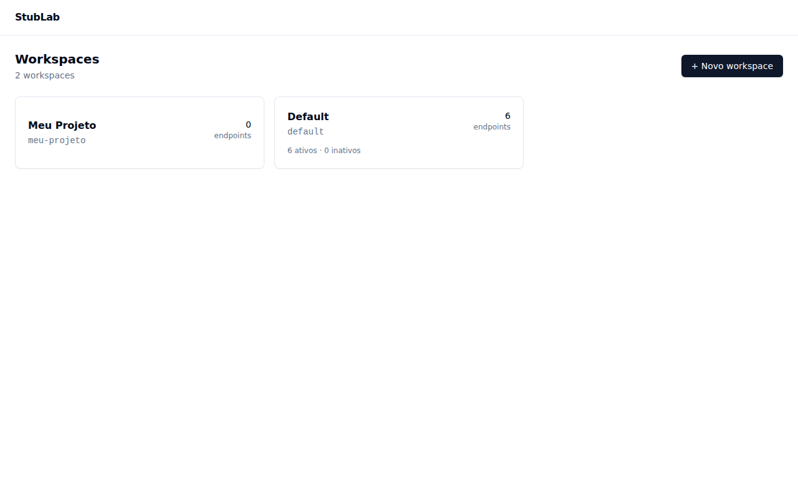
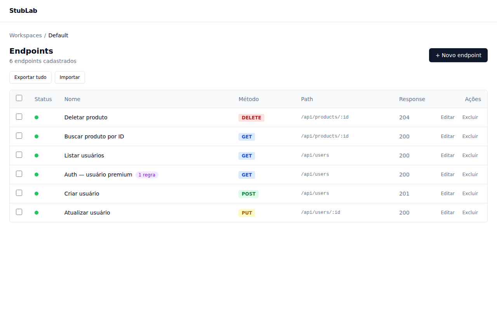
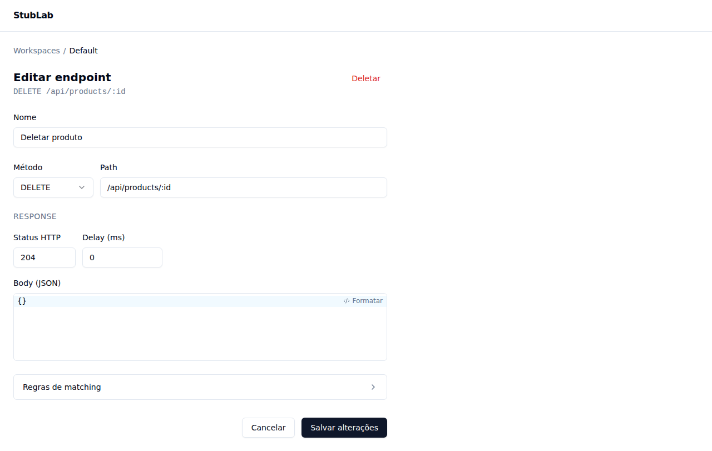
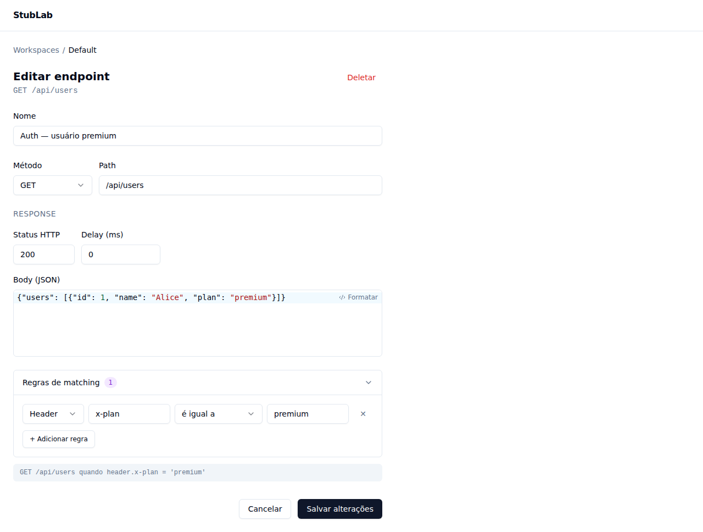
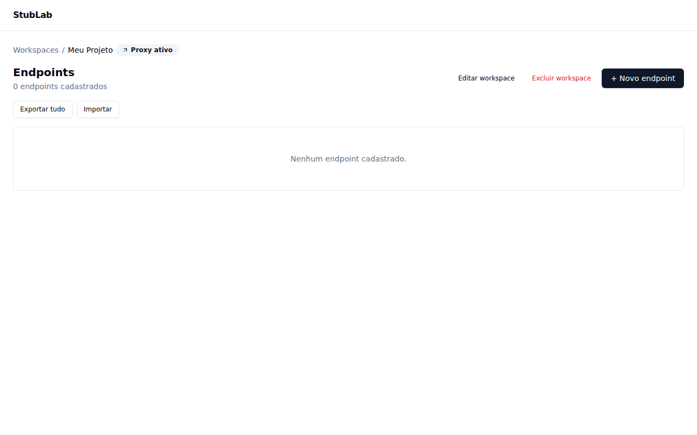
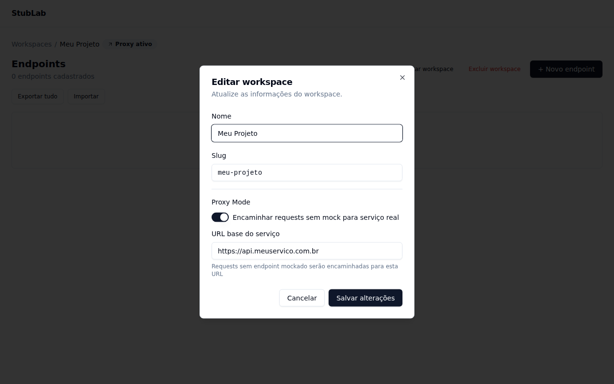

# StubLab

A self-hosted mock server with a web UI. Create and manage HTTP stubs without touching config files or restarting services.


---

## Screenshots

### Workspace selector
Organize stubs into isolated workspaces, each with its own URL namespace. See at a glance how many endpoints each workspace has and which ones are active.



### Endpoint list
All your stubs in one table — method badge, path, response status, and quick toggle to activate/deactivate without deleting.



### Create / edit an endpoint
Configure method, path, HTTP status, JSON body (with syntax highlighting and formatter), delay, and custom response headers.



### Matching rules (conditional responses)
Attach rules to make an endpoint respond only when specific conditions are met — inspect query params, headers, or JSON body fields with operators like `eq`, `contains`, `exists`.



### Proxy mode
Set a real upstream URL per workspace. Requests with no matching stub are forwarded transparently. The **Proxy ativo** badge is shown in the workspace header when proxy is active.

| Proxy badge | Proxy configuration |
|-------------|---------------------|
|  |  |

---

## Quick Start with Docker

```bash
# 1. Clone o repositório
git clone https://github.com/seu-usuario/stublab.git
cd stublab

# 2. Suba o container
docker compose up -d

# 3. Acesse a interface
open http://localhost:3000
```

### Variáveis de ambiente

| Variável | Padrão | Descrição |
|----------|--------|-----------|
| `PORT` | `3000` | Porta exposta |
| `DATABASE_URL` | `/app/data/stublab.db` | Caminho do banco SQLite |
| `LOG_LEVEL` | `info` | Nível de log |
| `NODE_ENV` | `production` | Ambiente |

Copie `.env.example` para `.env` e ajuste conforme necessário.

---

## What it does

StubLab lets your team define fake HTTP endpoints through a browser interface. Any request hitting `/mock/:workspace/*` is matched against your active stubs and returns the configured response — including status code, headers, body, and optional delay.

No YAML files. No restarts. Changes take effect immediately.

---

## Features

### Workspaces
- Organize endpoints into isolated **workspaces**, each with its own URL namespace
- Create, rename, and delete workspaces via the UI
- Every mock request is scoped to a workspace: `/mock/:slug/your-path`
- A `default` workspace is always available and cannot be deleted

### Endpoint management
- Create, edit, and delete HTTP stubs via a web UI
- Methods: `GET`, `POST`, `PUT`, `PATCH`, `DELETE`
- Configure response status, JSON body, headers, and artificial delay (ms)
- Toggle endpoints active/inactive without deleting them

### Advanced matching (conditional responses)
- Attach matching rules to an endpoint so it only responds when conditions are met
- Rules can inspect **query params**, **request headers**, or **JSON body fields** (dot notation for nested fields)
- Operators: `eq`, `neq`, `contains`, `exists`, `not_exists`
- Multiple active stubs can share the same method + path — the one with the most satisfied rules wins
- Fallback: an endpoint with no rules always matches as a catch-all

### Proxy mode
- Define a **proxy URL** per workspace — requests with no matching stub are forwarded transparently to the real service
- Toggle proxy on/off without losing the configured URL
- Mock always wins: a matching stub responds before the proxy is consulted
- Configurable timeout (`PROXY_TIMEOUT_MS`, default 10 s) with structured 504/502 error bodies
- `X-Stublab-Proxied: true` header on every proxied response (including errors)
- Global kill switch: `PROXY_ENABLED=false` disables proxy across all workspaces (useful for offline CI)
- "Proxy ativo" badge visible in the workspace header when proxy is active

### Import / Export
- Export all or selected endpoints as a JSON file
- Import endpoints from a previously exported file
- Three conflict strategies: **skip** (default), **overwrite**, or **duplicate**
- Preview what will be created/updated/skipped before confirming
- Export files include workspace metadata (v2 format)

### JSON editor
- `responseBody` field is a full code editor (CodeMirror 6) with JSON syntax highlighting
- Real-time validation — save button disabled while JSON is invalid
- One-click formatting (pretty-print with 2-space indent)
- Auto-growing height up to a configurable max

### Developer experience
- Path params supported (`/api/users/:id`)
- `delay` field to simulate slow APIs
- Custom response headers per endpoint
- 319 tests across API and UI

---

## Tech stack

| Layer    | Technology                                      |
|----------|-------------------------------------------------|
| Backend  | Node.js 20 · Fastify 5 · Zod · Drizzle ORM     |
| Database | SQLite (dev/self-hosted) · Postgres (planned)   |
| Frontend | React 18 · Vite · Tailwind CSS · shadcn/ui      |
| Editor   | CodeMirror 6 (`@uiw/react-codemirror`)          |
| Tests    | Vitest · Supertest · Testing Library            |
| Language | TypeScript (strict) throughout                  |
| Deploy   | Docker + docker-compose                         |

---

## Getting started

### Prerequisites

- Node.js 20+
- pnpm 9+

### Install

```bash
git clone https://github.com/fmorais/stublab.git
cd stublab
pnpm install
```

### Run in development

```bash
pnpm dev
```

This starts both servers in parallel:

| Service | URL                   |
|---------|-----------------------|
| API     | http://localhost:3000 |
| Web UI  | http://localhost:5173 |

The SQLite database is created automatically at `apps/api/stublab.db` on first run.

### Run the database migrations

```bash
cd apps/api
pnpm db:migrate
```

---

## Usage

### 1. Create a workspace

Open http://localhost:5173 and click **Novo workspace**. Give it a name — the slug is auto-generated and used in mock URLs.

A `default` workspace is pre-created so you can start immediately.

### 2. Create a stub

Inside a workspace, click **Novo endpoint** and fill in:

| Field           | Example                       |
|-----------------|-------------------------------|
| Name            | `List users`                  |
| Method          | `GET`                         |
| Path            | `/api/users`                  |
| Response status | `200`                         |
| Response body   | `{"users": []}`               |
| Delay           | `0` (ms)                      |

Click **Salvar**. The stub is immediately active.

### 3. Call your stub

```bash
# Using the default workspace
curl http://localhost:3000/mock/default/api/users
# → {"users":[]}

# Using a custom workspace slug
curl http://localhost:3000/mock/my-project/api/users
# → {"users":[]}
```

### 4. Add matching rules (conditional responses)

To return different responses for the same endpoint based on the request:

1. Open an endpoint and click **Adicionar regra**
2. Choose source (`query`, `header`, `body`), field name, operator, and value
3. Create a second endpoint with the same method + path but different rules and a different body

**Example:** return a filtered list when `?env=prod` is present

| Endpoint | Rules                         | Body                             |
|----------|-------------------------------|----------------------------------|
| GET /api/users | `query.env eq prod`   | `{"users": [{"id": 1}]}`         |
| GET /api/users | _(no rules — fallback)_ | `{"users": []}`                |

```bash
curl http://localhost:3000/mock/default/api/users?env=prod
# → {"users":[{"id":1}]}

curl http://localhost:3000/mock/default/api/users
# → {"users":[]}
```

The engine scores each candidate by how many rules it satisfies. The highest score wins. Ties are broken by creation date (most recent first).

### 5. Simulate slow responses

Set the **Delay** field to any number of milliseconds. The API will wait before responding — useful for testing loading states and timeouts.

### 6. Import / Export

Use the **Exportar** and **Importar** buttons in the endpoint list to backup or migrate stubs between workspaces. Export files include the workspace name and slug as metadata.

---

## API reference

All admin endpoints are under `/api`. The mock server listens on `/mock/:slug/*`.

### Workspaces

| Method | Path                        | Description              |
|--------|-----------------------------|--------------------------|
| GET    | `/api/workspaces`           | List all workspaces      |
| POST   | `/api/workspaces`           | Create workspace         |
| GET    | `/api/workspaces/:slug`     | Get workspace with stats |
| PUT    | `/api/workspaces/:slug`     | Update workspace (name, slug, proxyUrl, proxyEnabled) |
| DELETE | `/api/workspaces/:slug`     | Delete workspace         |

### Proxy config

| Method | Path                  | Description                          |
|--------|-----------------------|--------------------------------------|
| GET    | `/api/config/proxy`   | Global proxy config (env-based)      |

### Endpoints CRUD

All endpoint routes are scoped to a workspace via its slug:

| Method | Path                                              | Description              |
|--------|---------------------------------------------------|--------------------------|
| GET    | `/api/workspaces/:slug/endpoints`                 | List endpoints           |
| POST   | `/api/workspaces/:slug/endpoints`                 | Create endpoint          |
| GET    | `/api/workspaces/:slug/endpoints/:id`             | Get single endpoint      |
| PUT    | `/api/workspaces/:slug/endpoints/:id`             | Update endpoint          |
| PATCH  | `/api/workspaces/:slug/endpoints/:id/toggle`      | Toggle active/inactive   |
| DELETE | `/api/workspaces/:slug/endpoints/:id`             | Delete endpoint          |
| GET    | `/api/workspaces/:slug/endpoints/export`          | Export as JSON           |
| POST   | `/api/workspaces/:slug/endpoints/import/preview`  | Preview import           |
| POST   | `/api/workspaces/:slug/endpoints/import`          | Execute import           |

### Create endpoint — request body

```json
{
  "name": "List users",
  "method": "GET",
  "path": "/api/users",
  "responseStatus": 200,
  "responseBody": "{\"users\": []}",
  "responseHeaders": { "x-custom": "value" },
  "delay": 0,
  "matchingRules": [
    {
      "source": "query",
      "field": "env",
      "operator": "eq",
      "value": "prod"
    }
  ]
}
```

### Matching rule operators

| Operator     | Behavior                                     | `value` required |
|--------------|----------------------------------------------|------------------|
| `eq`         | Field equals value                           | Yes              |
| `neq`        | Field does not equal value (absent = passes) | Yes              |
| `contains`   | Field contains substring                     | Yes              |
| `exists`     | Field is present                             | No               |
| `not_exists` | Field is absent                              | No               |

Body fields support dot notation: `user.address.city`, `items.0.name`.

### Health check

```bash
curl http://localhost:3000/health
# → {"status":"ok"}
```

---

## Project structure

```
stublab/
├── apps/
│   ├── api/                  # Fastify backend
│   │   └── src/
│   │       ├── routes/
│   │       │   ├── workspaces/   # Workspace CRUD
│   │       │   ├── endpoints/    # Endpoint CRUD + import/export
│   │       │   └── config/       # Global config (proxy)
│   │       ├── mock/         # Mock engine + rule evaluator + proxy handler
│   │       ├── services/     # Business logic (proxy-service, workspace-service, …)
│   │       ├── config/       # Environment variable parsing
│   │       ├── db/           # Drizzle schema + migrations
│   │       └── schemas/      # Zod validation schemas
│   └── web/                  # React frontend
│       └── src/
│           ├── pages/        # Route-level components
│           ├── components/   # UI components
│           ├── hooks/        # API hooks (React Query)
│           └── lib/          # Utilities
├── .claude/
│   └── specs/                # Feature specs (SDD)
└── CLAUDE.md                 # Project constitution for AI agents
```

---

## Development

### Run tests

```bash
pnpm test              # all workspaces
```

Or per workspace:

```bash
cd apps/api && pnpm test
cd apps/web && pnpm test
```

### Database

```bash
cd apps/api

pnpm db:generate    # generate migration from schema changes
pnpm db:migrate     # apply pending migrations
pnpm db:studio      # open Drizzle Studio (visual DB browser)
```

### Environment variables

| Variable           | Default                    | Description                               |
|--------------------|----------------------------|-------------------------------------------|
| `PORT`             | `3000`                     | API server port                           |
| `CORS_ORIGIN`      | `http://localhost:5173`    | Allowed origin for CORS                   |
| `DATABASE_URL`     | `./stublab.db`             | SQLite path or Postgres URL               |
| `PROXY_ENABLED`    | `true`                     | Global kill switch for proxy mode         |
| `PROXY_TIMEOUT_MS` | `10000`                    | Timeout (ms) for calls to the real service|

Copy `.env.example` and adjust as needed:

```bash
cp apps/api/.env.example apps/api/.env
```

---

## Roadmap

- [ ] Request log — inspect incoming requests matched by the mock engine
- [ ] JSON schema-based autocomplete in the response body editor
- [ ] Postgres support in production

---

## License

MIT — see [LICENSE](./LICENSE).
